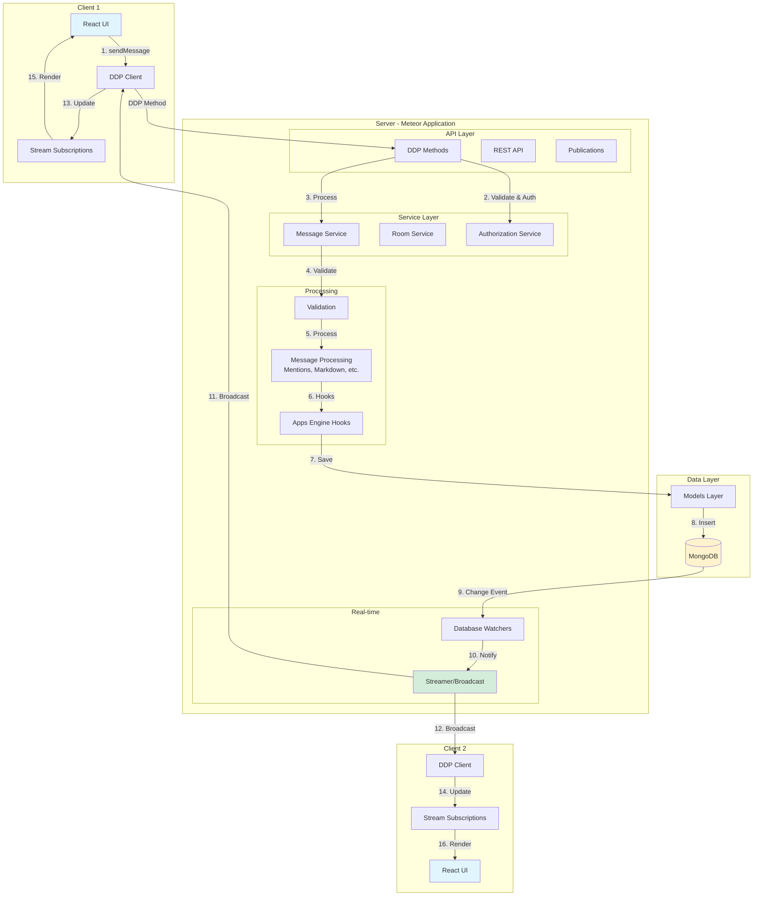
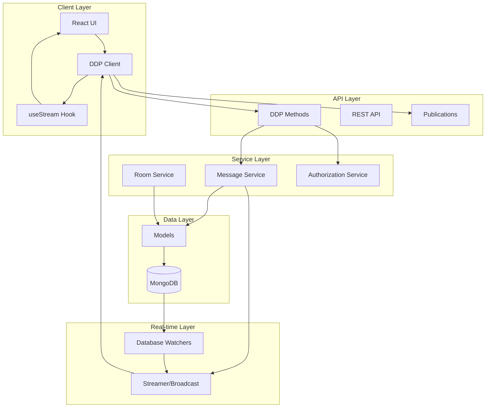
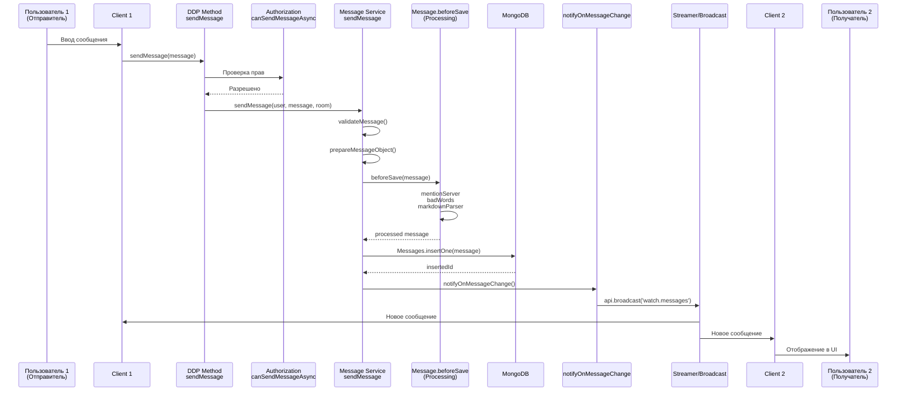
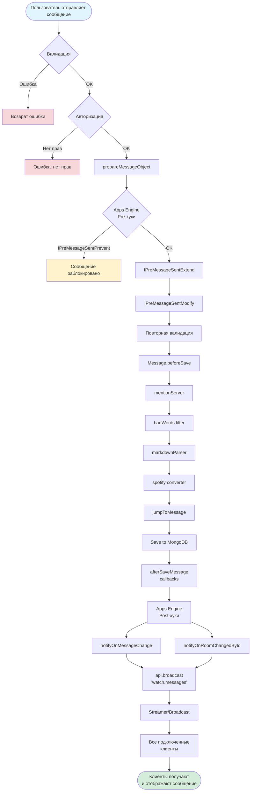
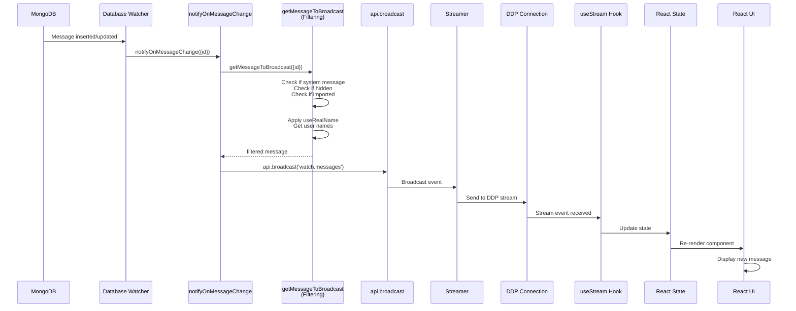
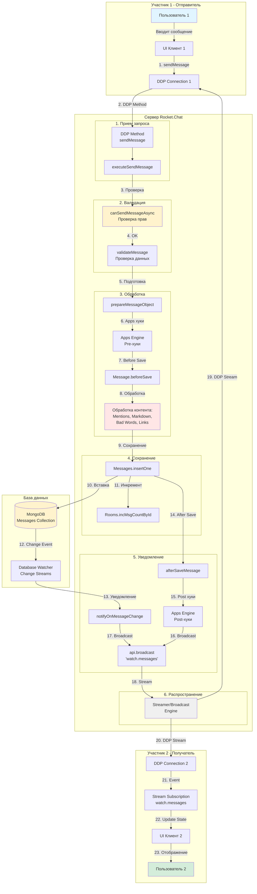
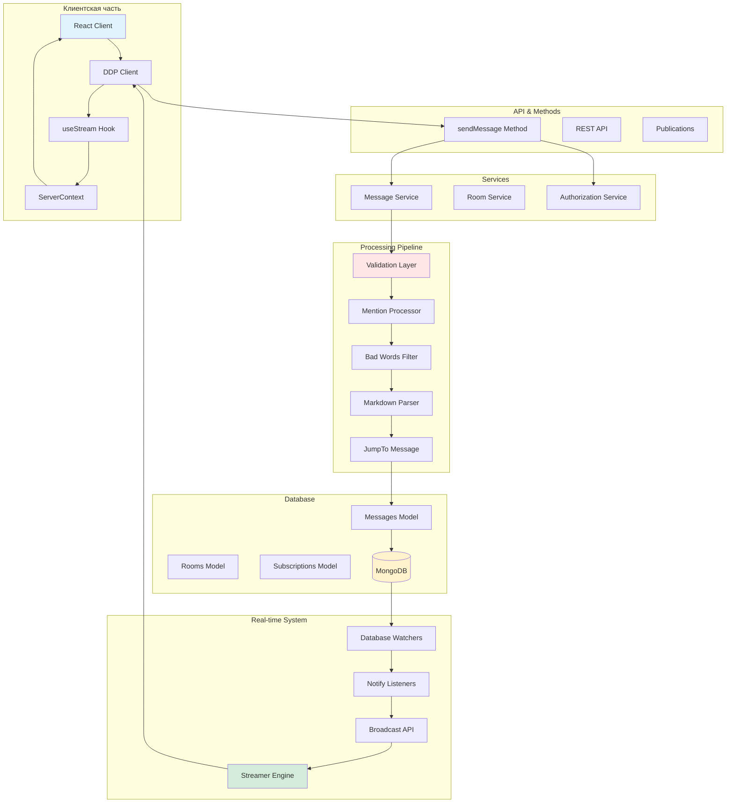

# Архитектурный анализ Rocket.Chat

## Обзор проекта

Rocket.Chat - это open-source платформа для командного общения, разработанная на TypeScript. Проект использует монoreпозиторий с несколькими приложениями и пакетами.

## Ключевые понятия Rocket.Chat

### Комнаты (Rooms)

**Комната (Room)** - основная единица организации общения в Rocket.Chat. Комната представляет собой пространство, где пользователи могут обмениваться сообщениями.

#### Типы комнат (Room Types)

Rocket.Chat поддерживает следующие типы комнат:

- **`'c'` - Channel (Канал)** - публичная комната, видимая всем пользователям. Любой может присоединиться к каналу через поиск или приглашение.
- **`'p'` - Private Group (Приватная группа)** - закрытая комната, доступная только участникам по приглашению. Не видна в списке публичных комнат.
- **`'d'` - Direct Message (Прямое сообщение)** - приватный чат между двумя пользователями. Создается автоматически при отправке первого сообщения.
- **`'l'` - Livechat** - комната для общения с посетителями сайта. Используется в Omnichannel для поддержки клиентов.
- **`'v'` - Voice Channel** - голосовой канал для аудио/видео звонков (если включена соответствующая функция).

#### Характеристики комнат

- **`rid` (Room ID)** - уникальный идентификатор комнаты
- **`name`** - имя комнаты (для каналов и групп)
- **`fname`** - отображаемое имя (friendly name)
- **`t`** - тип комнаты
- **`msgs`** - количество сообщений в комнате
- **`usersCount`** - количество участников
- **`u`** - создатель комнаты
- **`topic`** - тема/описание комнаты
- **`encrypted`** - флаг шифрования (E2E)
- **`ro` (read-only)** - режим только для чтения
- **`archived`** - архивная комната
- **`prid`** - ID родительской комнаты (для Discussions)
- **`teamId`** - ID команды (если комната принадлежит команде)
- **`teamMain`** - является ли главной комнатой команды

### Сообщения (Messages)

**Сообщение (Message)** - основная единица коммуникации в Rocket.Chat. Каждое сообщение содержит текст, метаданные и может иметь вложения.

#### Структура сообщения

- **`_id`** - уникальный идентификатор сообщения
- **`rid`** - ID комнаты, в которой находится сообщение
- **`msg`** - текст сообщения
- **`u`** - информация об отправителе (`_id`, `username`, `name`)
- **`ts`** - временная метка создания
- **`t`** - тип сообщения (опционально, для системных сообщений)
- **`tmid`** - ID родительского сообщения (для Threads)
- **`replies`** - массив ID пользователей, участвующих в треде
- **`mentions`** - массив упомянутых пользователей
- **`attachments`** - вложения (файлы, изображения, карточки)
- **`file`** - информация о файле (если сообщение содержит файл)
- **`editedAt`** - дата редактирования
- **`editedBy`** - информация о том, кто отредактировал
- **`unread`** - флаг непрочитанности (для read receipts)

#### Типы сообщений

Сообщения могут быть:
- **Обычными** - текст от пользователя
- **Системными** (`t` поле) - автоматические сообщения системы (например, "пользователь присоединился", "комната переименована")
- **E2E зашифрованными** - сообщения в зашифрованных комнатах
- **Thread сообщениями** - ответы в тредах

### Подписки (Subscriptions)

**Подписка (Subscription)** - связь пользователя с комнатой. Показывает участие пользователя в комнате и его настройки.

#### Ключевые поля подписки

- **`u`** - пользователь
- **`rid`** - ID комнаты
- **`t`** - тип комнаты
- **`name`** - имя комнаты
- **`open`** - открыта ли комната в клиенте
- **`unread`** - количество непрочитанных сообщений
- **`ls` (last seen)** - дата последнего просмотра комнаты
- **`lr` (last read)** - дата последнего прочитанного сообщения
- **`alert`** - есть ли непрочитанные важные сообщения
- **`userMentions`** - количество упоминаний пользователя
- **`groupMentions`** - количество упоминаний группы (`@all`, `@here`)
- **`desktopNotifications`** - настройки уведомлений на рабочем столе
- **`mobilePushNotifications`** - настройки push-уведомлений
- **`emailNotifications`** - настройки email-уведомлений
- **`encrypted`** - флаг шифрования комнаты
- **`f`** - добавлено в избранное

### Потоки (Threads)

**Thread (Поток)** - структурированное обсуждение внутри сообщения. Позволяет вести отдельную ветку разговора, связанную с конкретным сообщением.

#### Характеристики тредов

- **`tmid`** - ID родительского сообщения (thread message ID)
- **`replies`** - массив ID пользователей, участвующих в треде
- **`tcount`** - общее количество ответов в треде
- **`tshow`** - показывать ли ответ в основном потоке комнаты

#### Работа с тредами

1. Пользователь отвечает на сообщение, создавая ответ в треде
2. Ответ привязывается к родительскому сообщению через `tmid`
3. Система обновляет список участников треда в поле `replies`
4. Участники треда получают уведомления о новых ответах

### Обсуждения (Discussions)

**Discussion (Обсуждение)** - отдельная комната, созданная для обсуждения конкретного сообщения. В отличие от тредов, это полноценная комната со своими участниками.

#### Характеристики обсуждений

- **`prid`** - ID родительской комнаты (parent room ID)
- **`pmid`** - ID сообщения, которое послужило причиной создания обсуждения (parent message ID)
- Является отдельной комнатой типа `'c'` или `'p'`
- Может иметь собственных участников, независимо от родительской комнаты

### Команды (Teams)

**Team (Команда)** - организационная единица, объединяющая несколько комнат.

#### Характеристики команд

- **`teamId`** - уникальный идентификатор команды
- **`teamMain`** - флаг главной комнаты команды
- **`teamDefault`** - комната по умолчанию для команды
- Команда может содержать несколько комнат (каналов и групп)
- Пользователи присоединяются к команде, получая доступ к её комнатам

### Федерация (Federation)

**Federation** - возможность связи между разными серверами Rocket.Chat. Позволяет общаться пользователям разных серверов.

#### Особенности федерации

- Использует Matrix protocol (в Enterprise Edition)
- **`federated`** - флаг федеративной комнаты
- **`federation.eventId`** - ID события в федеративной сети
- Сообщения синхронизируются между серверами
- Пользователи могут участвовать в комнатах других серверов

### DDP (Distributed Data Protocol)

**DDP** - протокол Meteor для real-time коммуникации между клиентом и сервером.

#### Компоненты DDP

1. **Methods (Методы)** - RPC вызовы, синхронные операции (например, `sendMessage`)
2. **Publications (Публикации)** - подписки на наборы данных
3. **Streams (Потоки)** - real-time события (`watch.messages`, `watch.rooms`)

#### Работа DDP

- Устанавливает WebSocket соединение между клиентом и сервером
- Поддерживает автоматическое переподключение
- Обеспечивает синхронизацию данных в реальном времени

### Streams (Потоки событий)

**Streams** - механизм real-time уведомлений в Rocket.Chat. Позволяет клиентам подписываться на события.

#### Основные потоки

- **`watch.messages`** - события изменения сообщений (новые, обновленные, удаленные)
- **`watch.rooms`** - события изменения комнат
- **`watch.subscriptions`** - события изменения подписок
- **`watch.users`** - события изменения пользователей
- **`watch.settings`** - события изменения настроек
- **`watch.inquiries`** - события для Livechat (Omnichannel)
- **`watch.priorities`** - события приоритетов (Omnichannel)

#### Работа Streams

1. Сервер создает событие через `api.broadcast()`
2. Streamer распространяет событие всем подписанным клиентам
3. Клиенты подписываются через `getStream()` hook
4. При получении события обновляется локальное состояние

### Apps Engine

**Apps Engine** - система расширений Rocket.Chat, позволяющая создавать приложения, которые интегрируются с платформой.

#### Возможности Apps Engine

- **Hooks (Хуки)** - перехват и модификация событий:
  - `IPreMessageSentPrevent` - предотвратить отправку сообщения
  - `IPreMessageSentModify` - модифицировать сообщение перед отправкой
  - `IPostMessageSent` - обработка после отправки
- **Bridges (Мосты)** - интеграция с внешними системами
- **Command API** - создание пользовательских команд
- **UI Extensions** - расширение интерфейса

### End-to-End (E2E) Шифрование

**E2E Encryption** - сквозное шифрование сообщений, доступное только участникам комнаты.

#### Характеристики E2E

- **`encrypted`** - флаг шифрованной комнаты
- **`E2EKey`** - ключ шифрования комнаты
- **`e2eKeyId`** - идентификатор ключа
- Сообщения типа `'e2e'` содержат зашифрованный контент
- Использует алгоритм `m.megolm.v1.aes-sha2` (для федерации)

### Livechat / Omnichannel

**Livechat** - система для поддержки клиентов через веб-чат на сайте.

#### Компоненты Omnichannel

- **Inquiries** - входящие запросы от посетителей
- **Departments** - отделы поддержки
- **Agents** - агенты поддержки
- **Priorities** - приоритеты запросов
- **SLAs** (Service Level Agreements) - соглашения об уровне обслуживания
- **Transcripts** - расшифровки разговоров

#### Типы сообщений Livechat

- **`'l'`** - Livechat комната
- Комнаты создаются автоматически при обращении посетителя
- Агенты принимают запросы из очереди

### Пользователи (Users)

**User** - учетная запись пользователя в системе.

#### Типы пользователей

- **Обычный пользователь** - стандартная учетная запись
- **Bot** - бот, автоматизированный пользователь
- **Guest** - гость (для Livechat)
- **App User** - пользователь, созданный приложением

#### Ключевые поля пользователя

- **`_id`** - уникальный идентификатор
- **`username`** - имя пользователя (уникальное)
- **`name`** - отображаемое имя
- **`emails`** - массив email адресов
- **`roles`** - роли пользователя
- **`status`** - статус (online, away, busy, offline)
- **`type`** - тип пользователя

### Роли и разрешения

**Roles (Роли)** - набор разрешений, определяющих возможности пользователя.

#### Система разрешений

- **Permissions** - отдельные разрешения (например, `send-messages`, `delete-messages`)
- **Roles** - наборы разрешений (например, `admin`, `moderator`, `user`)
- Проверка прав осуществляется через `Authorization.canAccessRoom()`, `hasPermissionAsync()`
- Разрешения могут быть глобальными или для конкретной комнаты

### Database Watchers

**Database Watchers** - механизм отслеживания изменений в MongoDB и уведомления о них.

#### Принцип работы

1. MongoDB Change Streams отслеживают изменения в коллекциях
2. При изменении документа вызывается соответствующий watcher
3. Watcher вызывает функцию уведомления (например, `notifyOnMessageChange`)
4. Создается broadcast событие для распространения изменения

#### Оптимизация

- Можно отключить через `dbWatchersDisabled` для снижения нагрузки
- Watchers работают только при необходимости

### Обработка контента сообщений

#### Процессоры контента

1. **Mention Processor** - обработка упоминаний (`@username`, `@all`, `@here`)
   - Создает массив `mentions`
   - Уведомляет упомянутых пользователей
   
2. **Bad Words Filter** - фильтрация запрещенных слов
   - Настраиваемый список запрещенных слов
   - Возможность замены на звездочки или удаления

3. **Markdown Parser** - парсинг Markdown разметки
   - Поддержка базового Markdown
   - Поддержка KaTeX для математических формул
   - Emoji и emoticons

4. **JumpTo Message** - обработка ссылок на сообщения
   - Создает вложения с превью сообщений
   - Ссылки вида `[message](rocketchat://room?msg=messageId)`

5. **Spotify Converter** - преобразование Spotify ссылок
   - Автоматическое создание превью для Spotify треков

6. **URL Parser** - обработка URL в сообщениях
   - Автоматическое создание ссылок
   - Превью для некоторых типов URL

## Общая архитектура

### Архитектура системы (общая схема)



### Структура проекта

Проект организован как монoreпозиторий с использованием Yarn Workspaces и Turbo:

- **apps/** - основные приложения
  - `meteor/` - основное приложение (Meteor-based)
  - `uikit-playground/` - playground для UI Kit
- **packages/** - общие пакеты
- **ee/** - Enterprise Edition компоненты

### Технологический стек

- **Backend**: Node.js, Meteor (DDP - Distributed Data Protocol)
- **Frontend**: React, TypeScript
- **Database**: MongoDB
- **Real-time**: DDP Streams
- **Communication**: REST API + DDP methods

## Архитектура передачи сообщений

### Основные компоненты

1. **Client Layer** (Клиентский слой)
   - React приложение (`apps/meteor/client/`)
   - UI контексты и хуки (`packages/ui-contexts/`)
   - DDP клиент (`packages/ddp-client/`)

2. **API Layer** (API слой)
   - REST API endpoints
   - DDP Methods (`apps/meteor/server/methods/`)
   - Publications (`apps/meteor/server/publications/`)

3. **Service Layer** (Сервисный слой)
   - Core Services (`packages/core-services/`)
   - Message Service (`apps/meteor/server/services/messages/`)
   - Room Service

4. **Data Layer** (Слой данных)
   - Models (`packages/models/`)
   - MongoDB адаптер (`packages/mongo-adapter/`)

5. **Real-time Layer** (Real-time слой)
   - Streamer/Broadcast API
   - Database Watchers
   - WebSocket connections

## Поток сообщения от отправителя к получателю

### Этап 1: Клиент отправляет сообщение

**Код**: `apps/meteor/app/lib/client/methods/sendMessage.ts` → `apps/meteor/app/lib/server/methods/sendMessage.ts`

1. Пользователь вводит сообщение в клиентском приложении
2. Клиент вызывает DDP method `sendMessage`
3. Метод валидирует данные:
   - Проверка прав доступа (`canSendMessageAsync`)
   - Валидация размера сообщения
   - Проверка временных меток

### Этап 2: Обработка и сохранение сообщения

**Код**: `apps/meteor/app/lib/server/functions/sendMessage.ts`

1. **Валидация** (`validateMessage`)
   - Проверка структуры сообщения
   - Валидация вложений
   - Проверка кастомных полей

2. **Подготовка объекта сообщения** (`prepareMessageObject`)
   - Добавление информации об отправителе
   - Установка комнаты (rid)
   - Установка временных меток

3. **Apps Engine хуки** (если включены)
   - `IPreMessageSentPrevent` - возможность предотвратить отправку
   - `IPreMessageSentExtend` - расширение сообщения
   - `IPreMessageSentModify` - модификация сообщения

4. **Обработка контента** (`Message.beforeSave`)
   - Обработка упоминаний (`mentionServer`)
   - Фильтрация запрещенных слов (`badWords`)
   - Парсинг Markdown (`markdownParser`)
   - Обработка Spotify ссылок (`spotify`)
   - Обработка ссылок на сообщения (`jumpToMessage`)

5. **Сохранение в БД**
   - `Messages.insertOne(message)` - вставка в MongoDB
   - `Rooms.incMsgCountById(rid, 1)` - инкремент счетчика сообщений

### Этап 3: Real-time уведомление

**Код**: `apps/meteor/app/lib/server/lib/notifyListener.ts`

После сохранения сообщения запускаются уведомления:

1. **Apps Engine Post хуки**
   - `IPostMessageSent` или `IPostSystemMessageSent`

2. **After Save обработка**
   - `afterSaveMessage()` - коллбеки после сохранения

3. **Broadcast уведомления**
   ```typescript
   notifyOnMessageChange({ id: message._id })
   notifyOnRoomChangedById(message.rid)
   ```
   
   Эти функции используют `api.broadcast('watch.messages', { message })`

### Этап 4: Распространение через Streamer

**Код**: `packages/core-services/src/events/Events.ts`

1. `api.broadcast('watch.messages', { message })` транслирует событие
2. Streamer доставляет событие всем подписанным клиентам
3. Клиенты получают сообщение через DDP Streams

### Этап 5: Клиент получает сообщение

**Код**: `packages/ui-contexts/src/ServerContext.ts`, `packages/ui-contexts/src/hooks/useStream.ts`

1. Клиент подписывается на stream `watch.messages`
2. Получает событие о новом сообщении
3. Обновляет локальное состояние
4. Отображает сообщение в UI

## Детальный поток данных

### Общая архитектура системы



### Поток сообщения от отправителя к получателю



### Детальная схема обработки сообщения



### Архитектура компонентов системы сообщений

```mermaid
graph LR
    subgraph "Отправка сообщения"
        A1[Client UI] --> A2[DDP Method<br/>sendMessage]
        A2 --> A3[executeSendMessage]
        A3 --> A4[canSendMessageAsync]
        A4 --> A5[sendMessage function]
    end
    
    subgraph "Обработка сообщения"
        B1[validateMessage] --> B2[prepareMessageObject]
        B2 --> B3[Apps Engine Hooks]
        B3 --> B4[Message.beforeSave]
        B4 --> B5[mentionServer]
        B4 --> B6[badWords]
        B4 --> B7[markdownParser]
        B4 --> B8[jumpToMessage]
    end
    
    subgraph "Сохранение"
        C1[Messages.insertOne] --> C2[(MongoDB)]
        C1 --> C3[Rooms.incMsgCountById]
    end
    
    subgraph "Уведомление"
        D1[afterSaveMessage] --> D2[notifyOnMessageChange]
        D2 --> D3[getMessageToBroadcast]
        D3 --> D4[api.broadcast]
    end
    
    subgraph "Распространение"
        E1[Streamer] --> E2[DDP Connections]
        E2 --> E3[Client Streams]
    end
    
    A5 --> B1
    B8 --> C1
    C1 --> D1
    D4 --> E1
    E3 --> F1[Client Updates UI]
    
    style A1 fill:#e1f5ff
    style C2 fill:#fff3cd
    style E1 fill:#d4edda
    style F1 fill:#d4edda
```



### Получение сообщения клиентом



## Компоненты системы

### Message Service

**Расположение**: `apps/meteor/server/services/messages/service.ts`

Основные методы:
- `sendMessage()` - отправка сообщения
- `saveMessageFromFederation()` - сохранение сообщений из федерации
- `sendMessageWithValidation()` - отправка с валидацией
- `beforeSave()` - обработка перед сохранением
- `deleteMessage()` - удаление
- `updateMessage()` - обновление
- `reactToMessage()` - реакции

### Notify Listeners

**Расположение**: `apps/meteor/app/lib/server/lib/notifyListener.ts`

Функции уведомления:
- `notifyOnMessageChange()` - уведомление об изменении сообщения
- `notifyOnRoomChangedById()` - уведомление об изменении комнаты
- `notifyOnSubscriptionChanged()` - уведомление об изменении подписки

### Core Services API

**Расположение**: `packages/core-services/`

- `api.broadcast()` - широковещательная рассылка событий
- Stream-based real-time коммуникация

### Models

**Расположение**: `packages/models/`

- `Messages` - модель сообщений
- `Rooms` - модель комнат
- `Subscriptions` - модель подписок
- `Users` - модель пользователей

## Real-time механизм

### DDP (Distributed Data Protocol)

Rocket.Chat использует Meteor's DDP для real-time коммуникации:

1. **Methods** - RPC вызовы (например, `sendMessage`)
2. **Publications** - подписки на данные
3. **Streams** - real-time события (`watch.messages`, `watch.rooms`)

### Streams

Streams позволяют клиентам подписаться на события в реальном времени:

- `watch.messages` - новые/обновленные сообщения
- `watch.rooms` - изменения комнат
- `watch.subscriptions` - изменения подписок
- `watch.users` - изменения пользователей

## Безопасность и валидация

### Проверки при отправке

1. **Авторизация**
   - `canSendMessageAsync()` - проверка прав отправки в комнату
   - Проверка типа пользователя (bot, user)

2. **Валидация данных**
   - Размер сообщения (`Message_MaxAllowedSize`)
   - Синхронизация временных меток
   - Валидация вложений и ссылок

3. **Шифрование**
   - E2E шифрование для зашифрованных комнат
   - Проверка типа сообщения для E2E комнат

## Особенности

### Apps Engine

Rocket.Chat поддерживает Apps Engine для расширяемости:

- **Pre-хуки**: могут предотвратить или модифицировать сообщение
- **Post-хуки**: выполняются после сохранения
- **Bridges**: интеграция с внешними системами

### Federation (Enterprise)

Для федеративных комнат используется Matrix protocol:

- `saveMessageFromFederation()` - сохранение сообщений из других серверов
- Специальная обработка федеративных сообщений

### Threads

Поддержка потоков (threads) для сообщений:

- `tmid` - ID родительского сообщения
- `tshow` - показывать ли в основном потоке

## Производительность

### Оптимизации

1. **Database Watchers**
   - Отключение при необходимости (`dbWatchersDisabled`)
   - Оптимизированные запросы к MongoDB

2. **Broadcast оптимизация**
   - Фильтрация системных сообщений
   - Кэширование настроек и имен пользователей

3. **Pagination**
   - Курсорная пагинация для истории сообщений
   - Ленивая загрузка

### Полный цикл: от одного участника к другому



### Компоненты системы сообщений (детальная схема)



## Заключение

Rocket.Chat использует гибридную архитектуру:

- **Synchronous**: DDP Methods для действий (отправка сообщений)
- **Asynchronous**: Streams для real-time обновлений (получение сообщений)
- **Database**: MongoDB как единый источник правды
- **Real-time**: DDP Streamer для распространения событий

Архитектура позволяет масштабироваться как вертикально (один сервер), так и горизонтально (множество серверов с общим брокером событий).

### Ключевые моменты потока сообщений

1. **Отправка (Synchronous)**: Клиент → DDP Method → Валидация → Обработка → MongoDB
2. **Уведомление (Asynchronous)**: MongoDB Change → Watcher → Notify → Broadcast → Streamer
3. **Получение (Asynchronous)**: Streamer → DDP Stream → Client Hook → UI Update

Все сообщения проходят через единый pipeline обработки перед сохранением, что обеспечивает консистентность и возможность расширения функциональности через Apps Engine.

