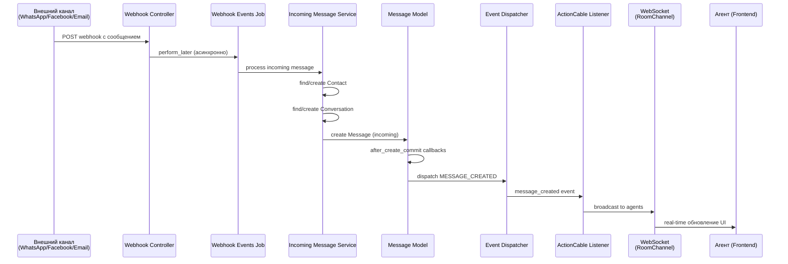
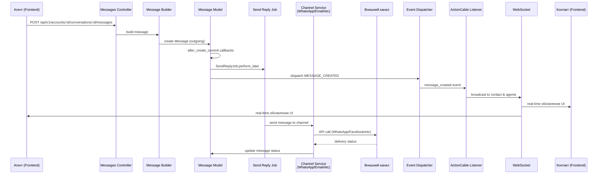
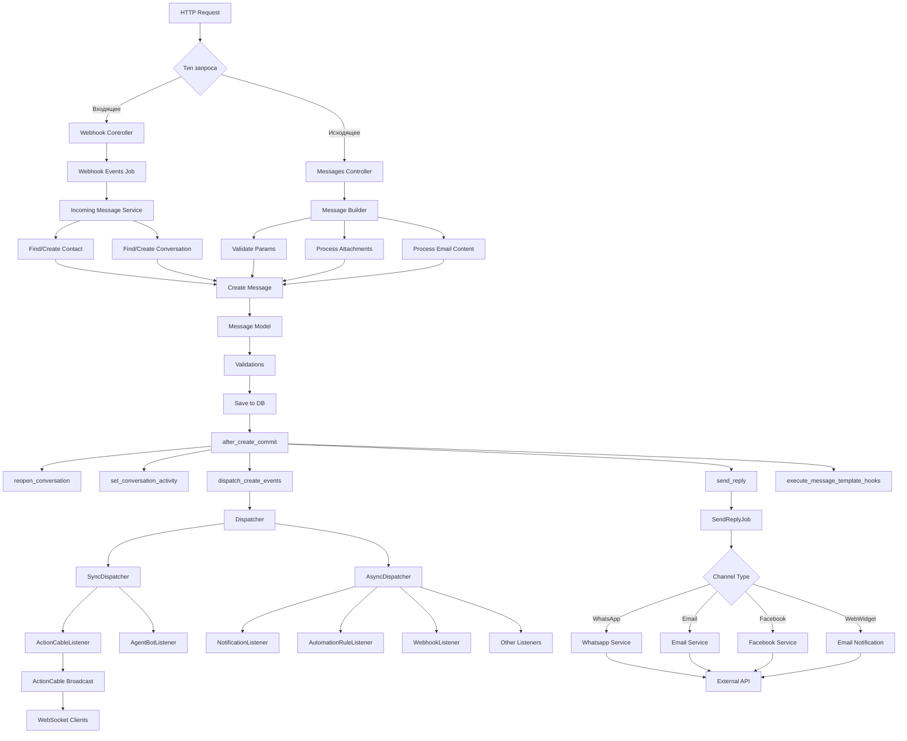
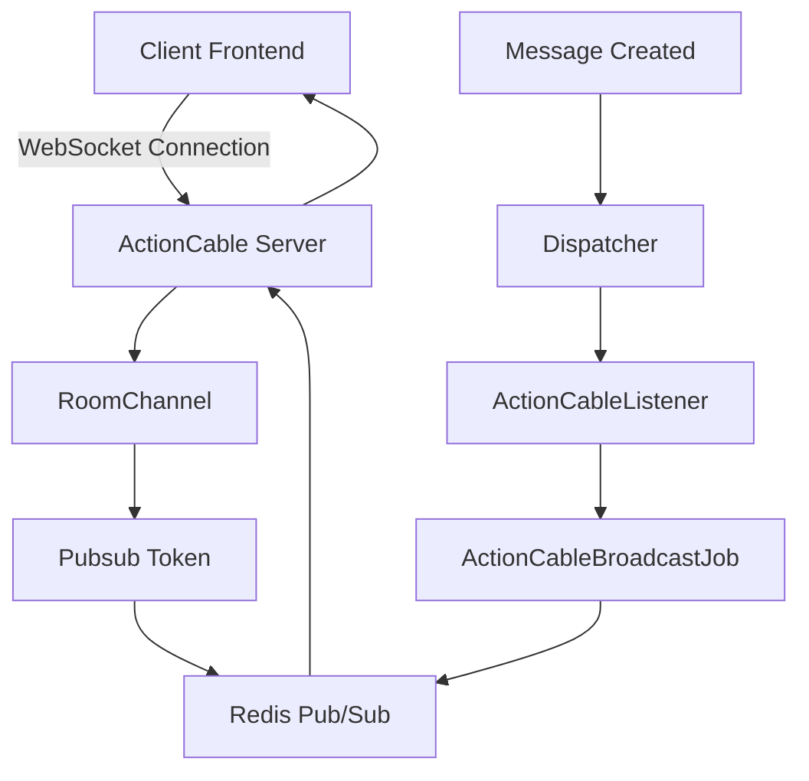
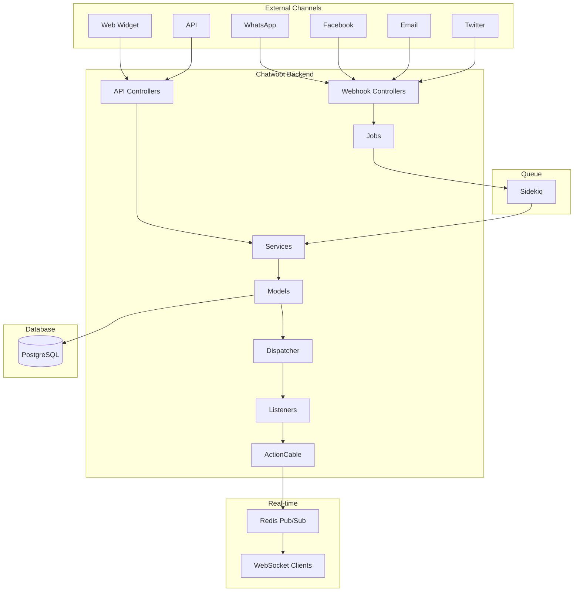
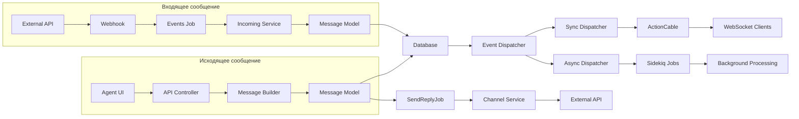
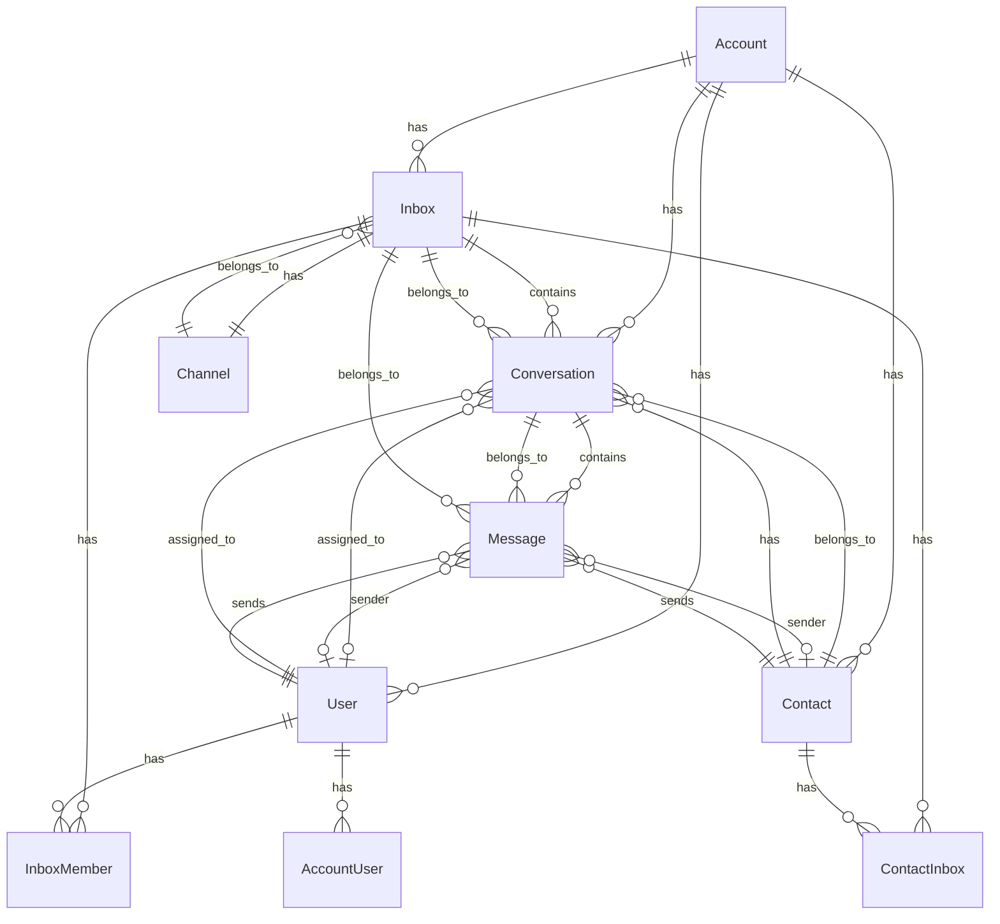
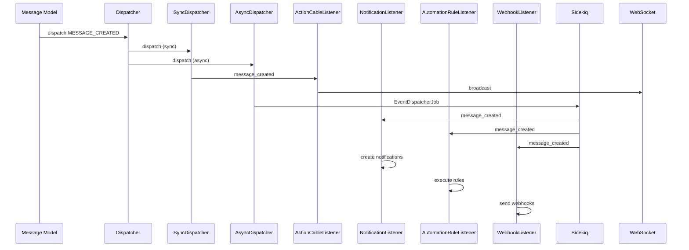

# Архитектура Chatwoot

## Оглавление

1. [Ключевые понятия](#ключевые-понятия)
2. [Общая архитектура](#общая-архитектура)
3. [Поток сообщений](#поток-сообщений)
4. [Компоненты системы](#компоненты-системы)
5. [Схемы взаимодействия](#схемы-взаимодействия)

---

## Ключевые понятия

### Account (Аккаунт)
- **Описание**: Верхнеуровневая организационная единица в Chatwoot. Один Account может содержать несколько Inbox'ов, Users, Contacts и Conversations.
- **Назначение**: Мультитенантность - изоляция данных между разными организациями/компаниями
- **Связи**: Имеет множество Inboxes, Users, Contacts, Conversations

### Inbox (Входящий канал)
- **Описание**: Канал связи, через который клиенты могут обращаться (например, Email, WhatsApp, Facebook, Web Widget, API и т.д.)
- **Назначение**: Абстракция над различными каналами коммуникации
- **Типы**: 
  - `Channel::WebWidget` - виджет на сайте
  - `Channel::Email` - электронная почта
  - `Channel::Whatsapp` - WhatsApp
  - `Channel::FacebookPage` - Facebook Messenger
  - `Channel::TwitterProfile` - Twitter
  - `Channel::Telegram` - Telegram
  - `Channel::Api` - API для интеграций
  - И другие
- **Связи**: Принадлежит Account, имеет Channel, содержит Conversations

### Channel (Канал)
- **Описание**: Конкретная реализация канала связи (полиморфная связь с Inbox)
- **Назначение**: Хранит специфичные для канала настройки и конфигурацию (токены, API ключи, webhook URL и т.д.)
- **Примеры**: 
  - `Channel::Whatsapp` хранит phone_number, provider_config
  - `Channel::Email` хранит email_address, forward_to_email
  - `Channel::WebWidget` хранит website_url, welcome_title

### Conversation (Разговор)
- **Описание**: Диалог между Contact и агентом/ботом через конкретный Inbox
- **Назначение**: Контейнер для сообщений, управление статусом разговора
- **Статусы**: 
  - `open` - открыт
  - `resolved` - решен
  - `pending` - ожидает обработки (обычно для ботов)
  - `snoozed` - отложен
- **Приоритеты**: `low`, `medium`, `high`, `urgent`
- **Связи**: Принадлежит Account, Inbox, Contact, может иметь Assignee (User), Team, Campaign

### Message (Сообщение)
- **Описание**: Отдельное сообщение в Conversation
- **Типы сообщений**:
  - `incoming` - входящее от контакта
  - `outgoing` - исходящее от агента/бота
  - `activity` - системное сообщение (например, "разговор назначен агенту")
  - `template` - шаблонное сообщение
- **Типы контента**: `text`, `input_text`, `cards`, `form`, `article`, `voice_call` и другие
- **Статусы**: `sent`, `delivered`, `read`, `failed`
- **Связи**: Принадлежит Account, Inbox, Conversation, имеет Sender (polymorphic: User или Contact)

### Contact (Контакт)
- **Описание**: Клиент/пользователь, который обращается через Inbox
- **Назначение**: Хранит информацию о клиенте (имя, email, телефон, дополнительные атрибуты)
- **Типы**: `visitor`, `lead`, `customer`
- **Связи**: Принадлежит Account, может иметь Company, имеет множество Conversations через ContactInbox

### ContactInbox
- **Описание**: Связь между Contact и Inbox с уникальным идентификатором для канала (source_id)
- **Назначение**: Один Contact может иметь разные идентификаторы в разных каналах
- **Идентификаторы по каналам**:
  - **Email**: `email` адрес (например, `user@example.com`)
  - **WhatsApp**: `phone_number` без символа `+` (например, `1234567890`)
  - **Telegram**: `user_id` (числовой ID пользователя из Telegram API, например, `123456789`)
  - **SMS/Twilio**: `phone_number` в формате E.164 (например, `+1234567890`)
  - **Web Widget/API**: `UUID` (случайно сгенерированный)
  - **Facebook/Instagram**: `page_scoped_id` (ID пользователя в контексте страницы)
- **Важно**: В Telegram используется именно `user_id` (числовой ID), а не username или phone_number, так как:
  - `user_id` всегда присутствует и уникален
  - `username` может отсутствовать или изменяться
  - `phone_number` обычно недоступен через Bot API
- **Связи**: Принадлежит Contact и Inbox, имеет pubsub_token для WebSocket соединений

### User (Пользователь)
- **Описание**: Агент поддержки или администратор системы
- **Типы**: 
  - `User` - обычный пользователь
  - `SuperAdmin` - суперадминистратор платформы
- **Роли в Account**: 
  - `administrator` - администратор аккаунта
  - `agent` - агент поддержки
- **Связи**: Может принадлежать нескольким Accounts через AccountUser, может быть Assignee в Conversations

### Dispatcher (Диспетчер событий)
- **Описание**: Система обработки событий в приложении
- **Типы**:
  - `SyncDispatcher` - синхронная обработка (ActionCable, AgentBot)
  - `AsyncDispatcher` - асинхронная обработка через Sidekiq (Automation Rules, Webhooks, Notifications и т.д.)
- **Назначение**: Публикация событий (MESSAGE_CREATED, CONVERSATION_UPDATED и т.д.) для различных Listeners

### Listener (Слушатель событий)
- **Описание**: Компоненты, которые реагируют на события системы
- **Примеры**:
  - `ActionCableListener` - отправка событий через WebSocket
  - `NotificationListener` - создание уведомлений
  - `AutomationRuleListener` - выполнение правил автоматизации
  - `WebhookListener` - отправка webhooks внешним системам

---

## Общая архитектура

Chatwoot построен на Ruby on Rails с использованием:
- **Backend**: Ruby on Rails (API)
- **Frontend**: Vue.js 3 (Composition API)
- **WebSocket**: ActionCable (для real-time обновлений)
- **Job Queue**: Sidekiq (для фоновых задач)
- **Database**: PostgreSQL
- **Search**: Elasticsearch (опционально, для advanced search)

### Основные слои архитектуры:

1. **API Layer** (Controllers) - обработка HTTP запросов
2. **Service Layer** - бизнес-логика
3. **Model Layer** - данные и валидации
4. **Job Layer** - асинхронные задачи
5. **Event Layer** (Dispatcher/Listeners) - обработка событий
6. **Channel Layer** (ActionCable) - real-time коммуникация

---

## Поток сообщений

### Входящее сообщение (от контакта к агенту)



### Исходящее сообщение (от агента к контакту)



### Детальный поток создания сообщения



---

## Компоненты системы

### 1. Controllers (API Layer)

#### MessagesController
- **Путь**: `app/controllers/api/v1/accounts/conversations/messages_controller.rb`
- **Назначение**: Обработка HTTP запросов для создания/обновления сообщений
- **Методы**:
  - `create` - создание нового сообщения
  - `update` - обновление статуса сообщения (только для API inbox)
  - `destroy` - удаление сообщения
  - `retry` - повторная отправка сообщения
  - `translate` - перевод сообщения

#### Webhook Controllers
- **Пример**: `app/controllers/webhooks/whatsapp_controller.rb`
- **Назначение**: Прием webhook'ов от внешних сервисов
- **Процесс**: 
  1. Валидация токена
  2. Асинхронная обработка через Job
  3. Возврат 200 OK

### 2. Services (Business Logic)

#### MessageBuilder
- **Путь**: `app/builders/messages/message_builder.rb`
- **Назначение**: Построение сообщения из параметров запроса
- **Функции**:
  - Валидация параметров
  - Обработка вложений
  - Обработка email контента (HTML/текст)
  - Определение отправителя (User или Contact)
  - Обработка Liquid шаблонов

#### Incoming Message Services
- **Примеры**: 
  - `Whatsapp::IncomingMessageService`
  - `Email::IncomingMessageService`
  - `Facebook::IncomingMessageService`
- **Назначение**: Обработка входящих сообщений от внешних каналов
- **Процесс**:
  1. Парсинг payload от внешнего сервиса
  2. Поиск/создание Contact
  3. Поиск/создание Conversation
  4. Создание Message (incoming)

#### Channel Send Services
- **Примеры**:
  - `Whatsapp::SendOnWhatsappService`
  - `Email::SendOnEmailService`
  - `Twitter::SendOnTwitterService`
- **Назначение**: Отправка сообщений во внешние каналы
- **Процесс**:
  1. Получение конфигурации канала
  2. Форматирование сообщения для канала
  3. API вызов к внешнему сервису
  4. Обновление статуса сообщения

### 3. Models (Data Layer)

#### Message Model
- **Путь**: `app/models/message.rb`
- **Ключевые колбэки**:
  - `after_create_commit`: 
    - `reopen_conversation` - открытие разговора если он был закрыт
    - `set_conversation_activity` - обновление last_activity_at
    - `dispatch_create_events` - отправка событий
    - `send_reply` - запуск SendReplyJob
    - `execute_message_template_hooks` - выполнение хуков шаблонов
  - `after_update_commit`: `dispatch_update_event`
- **Валидации**:
  - Проверка на флуд сообщений (лимит на минуту)
  - Максимальная длина контента (150,000 символов)
  - Валидация content_attributes

#### Conversation Model
- **Путь**: `app/models/conversation.rb`
- **Ключевые колбэки**:
  - `after_create_commit`: `notify_conversation_creation`
  - `after_update_commit`: 
    - `handle_resolved_status_change`
    - `notify_status_change`
    - `create_activity`
    - `notify_conversation_updation`
- **Статусы**: open, resolved, pending, snoozed
- **Приоритеты**: low, medium, high, urgent

### 4. Jobs (Background Processing)

#### SendReplyJob
- **Путь**: `app/jobs/send_reply_job.rb`
- **Назначение**: Асинхронная отправка сообщения во внешний канал
- **Процесс**:
  1. Определение типа канала
  2. Выбор соответствующего сервиса отправки
  3. Вызов сервиса для отправки

#### Webhook Events Jobs
- **Примеры**: 
  - `Webhooks::WhatsappEventsJob`
  - `Webhooks::FacebookEventsJob`
  - `Webhooks::TelegramEventsJob`
- **Назначение**: Асинхронная обработка webhook'ов от внешних сервисов
- **Процесс**:
  1. Парсинг payload
  2. Поиск соответствующего канала
  3. Вызов Incoming Message Service

### 5. Event System (Dispatcher/Listeners)

#### Dispatcher
- **Путь**: `app/dispatchers/dispatcher.rb`
- **Назначение**: Централизованная система событий
- **Типы**:
  - `SyncDispatcher` - синхронная обработка
  - `AsyncDispatcher` - асинхронная через Sidekiq

#### ActionCableListener
- **Путь**: `app/listeners/action_cable_listener.rb`
- **Назначение**: Отправка событий через WebSocket
- **События**:
  - `message_created` - новое сообщение
  - `message_updated` - обновление сообщения
  - `conversation_created` - новый разговор
  - `conversation_updated` - обновление разговора
  - И другие

#### RoomChannel
- **Путь**: `app/channels/room_channel.rb`
- **Назначение**: WebSocket канал для real-time обновлений
- **Функции**:
  - Подписка на события аккаунта
  - Отслеживание присутствия (presence)
  - Broadcast событий клиентам

### 6. WebSocket Architecture



---

## Схемы взаимодействия

### Общая архитектура системы



### Поток данных сообщения



### Модель данных (основные связи)



### Event Flow (поток событий)



---

## Детальный анализ потока сообщения

### Сценарий 1: Контакт отправляет сообщение через WhatsApp

1. **Webhook от WhatsApp** → `Webhooks::WhatsappController#process_payload`
   - Валидация токена
   - Асинхронная обработка: `Webhooks::WhatsappEventsJob.perform_later`

2. **Webhook Events Job** → `Webhooks::WhatsappEventsJob#perform`
   - Поиск канала по phone_number
   - Выбор сервиса (WhatsappCloud или стандартный)
   - Вызов: `Whatsapp::IncomingMessageService.new(...).perform`

3. **Incoming Message Service**:
   - Парсинг payload от WhatsApp
   - Поиск/создание Contact по phone_number
   - Поиск/создание Conversation
   - Создание Message (incoming, content, sender: Contact)

4. **Message Model** → `after_create_commit`:
   - `reopen_conversation` - если разговор был resolved, открыть его
   - `set_conversation_activity` - обновить last_activity_at
   - `dispatch_create_events` - отправить событие MESSAGE_CREATED
   - `send_reply` - для входящих не выполняется
   - `execute_message_template_hooks` - выполнить хуки

5. **Event Dispatcher**:
   - **SyncDispatcher** → `ActionCableListener#message_created`
     - Определение токенов для broadcast (агенты inbox + контакт)
     - `ActionCableBroadcastJob.perform_later` с токенами и данными
   - **AsyncDispatcher** → различные listeners через Sidekiq:
     - `NotificationListener` - создание уведомлений для агентов
     - `AutomationRuleListener` - выполнение правил автоматизации
     - `WebhookListener` - отправка webhooks если настроены

6. **ActionCable Broadcast**:
   - Отправка события через Redis Pub/Sub
   - Клиенты (агенты и контакт) получают обновление через WebSocket

### Сценарий 2: Агент отправляет ответ контакту

1. **HTTP Request** → `Api::V1::Accounts::Conversations::MessagesController#create`
   - Параметры: content, attachments, private и т.д.

2. **Message Builder**:
   - Валидация параметров
   - Обработка вложений
   - Обработка email контента (если email inbox)
   - Определение sender (User)
   - Построение message_params

3. **Message Model** → `save!`:
   - Валидации (флуд, длина контента)
   - Сохранение в БД

4. **Message Model** → `after_create_commit`:
   - `reopen_conversation` - не выполняется для outgoing
   - `set_conversation_activity` - обновить last_activity_at
   - `dispatch_create_events` - отправить MESSAGE_CREATED
   - `send_reply` - **запустить SendReplyJob**
   - `execute_message_template_hooks`

5. **SendReplyJob** (асинхронно):
   - Определение типа канала (WhatsApp/Email/Facebook и т.д.)
   - Выбор соответствующего сервиса отправки
   - Вызов: `Whatsapp::SendOnWhatsappService.new(message: message).perform`
   - Сервис отправляет сообщение через API внешнего сервиса
   - Обновление статуса сообщения (sent/delivered/failed)

6. **Event Dispatcher** (аналогично сценарию 1):
   - Broadcast через ActionCable
   - Обработка через Async Listeners

### Сценарий 3: Обновление статуса сообщения

Когда внешний сервис (например, WhatsApp) отправляет webhook о доставке/прочтении:

1. **Webhook** → соответствующий контроллер
2. **Events Job** → обработка статуса
3. **Status Update Service** → `Messages::StatusUpdateService`
4. **Message Model** → `update(status: 'delivered')`
5. **after_update_commit** → `dispatch_update_event`
6. **ActionCableListener** → `message_updated` event
7. **Broadcast** → обновление UI у всех клиентов

---

## Технические детали

### WebSocket соединение

Клиенты подключаются к `RoomChannel` с параметрами:
- `pubsub_token` - уникальный токен пользователя/контакта
- `user_id` - для агентов
- `account_id` - ID аккаунта

Канал подписывается на:
- `pubsub_token` - персональные события
- `account_{account_id}` - события аккаунта (для агентов)

### Обработка событий

События обрабатываются в двух режимах:

1. **Синхронно** (SyncDispatcher):
   - ActionCable - для немедленной отправки через WebSocket
   - AgentBot - для немедленной обработки ботом

2. **Асинхронно** (AsyncDispatcher):
   - Через Sidekiq для тяжелых операций
   - Notifications, Webhooks, Automation Rules и т.д.

### Обработка вложений

1. Загрузка файла через Active Storage
2. Создание Attachment записи
3. Для отправки: загрузка во внешний сервис (S3, Cloudinary и т.д.)
4. Получение URL и добавление в content_attributes сообщения

### Мультиканальность

Один Contact может иметь несколько ContactInbox записей, каждая с уникальным source_id для своего канала:
- **Email**: `source_id = email` (например, `user@example.com`)
- **WhatsApp**: `source_id = phone_number` без `+` (например, `1234567890`)
- **Telegram**: `source_id = user_id` (числовой ID из Telegram API, например, `123456789`)
- **SMS**: `source_id = phone_number` (например, `+1234567890`)
- **Web Widget**: `source_id = UUID` (случайно сгенерированный при первом визите)
- **API**: `source_id = UUID` (предоставляется клиентом или генерируется)

**Детали идентификации в Telegram:**

В Telegram используется **числовой user_id** (не username и не phone_number) как `source_id` для ContactInbox. Это реализовано в `Telegram::IncomingMessageService`:

```ruby
# app/services/telegram/incoming_message_service.rb
def set_contact
  contact_inbox = ::ContactInboxWithContactBuilder.new(
    source_id: telegram_params_from_id,  # <- используется user_id
    inbox: inbox,
    contact_attributes: contact_attributes
  ).perform
end

# app/services/telegram/param_helpers.rb
def telegram_params_from_id
  return telegram_params_base_object[:chat][:id] if business_message?
  telegram_params_base_object[:from][:id]  # <- это числовой user_id
end
```

**Почему user_id, а не username или phone_number?**

1. **user_id** (числовой ID):
   - ✅ Всегда присутствует в каждом сообщении от пользователя
   - ✅ Уникален и постоянен (не меняется)
   - ✅ Используется для отправки сообщений через Telegram Bot API
   - ✅ Это стандартный идентификатор в Telegram API

2. **username** (@username):
   - ❌ Может отсутствовать (пользователь может не иметь username)
   - ❌ Может изменяться пользователем
   - ❌ Не используется для отправки сообщений (нужен user_id)
   - ✅ Сохраняется в `contact.additional_attributes.social_telegram_user_name` для отображения в UI

3. **phone_number**:
   - ❌ Обычно недоступен через Telegram Bot API (защита приватности)
   - ❌ Доступен только если пользователь сам отправит контактную карточку
   - ❌ Не используется для идентификации

**Пример payload от Telegram:**
```json
{
  "message": {
    "from": {
      "id": 123456789,           // <- используется как source_id
      "is_bot": false,
      "first_name": "John",
      "last_name": "Doe",
      "username": "johndoe",     // <- опционально, сохраняется в additional_attributes
      "language_code": "en"
    },
    "chat": {
      "id": 123456789,           // <- для приватных чатов равен from.id
      "type": "private"
    }
  }
}
```

Все разговоры связаны через Contact, что позволяет видеть полную историю взаимодействий клиента через все каналы.

---

## Заключение

Chatwoot использует event-driven архитектуру с четким разделением ответственности:

- **Controllers** - обработка HTTP запросов
- **Services** - бизнес-логика
- **Models** - данные и валидации
- **Jobs** - асинхронная обработка
- **Dispatcher/Listeners** - система событий
- **ActionCable** - real-time коммуникация

Поток сообщений проходит через несколько этапов:
1. Прием (Webhook или API)
2. Обработка (Service/Builder)
3. Сохранение (Model)
4. События (Dispatcher)
5. Уведомления (Listeners)
6. Отправка (Channel Services)
7. Real-time обновления (ActionCable)

Такая архитектура обеспечивает масштабируемость, гибкость и возможность расширения функциональности через систему событий.

