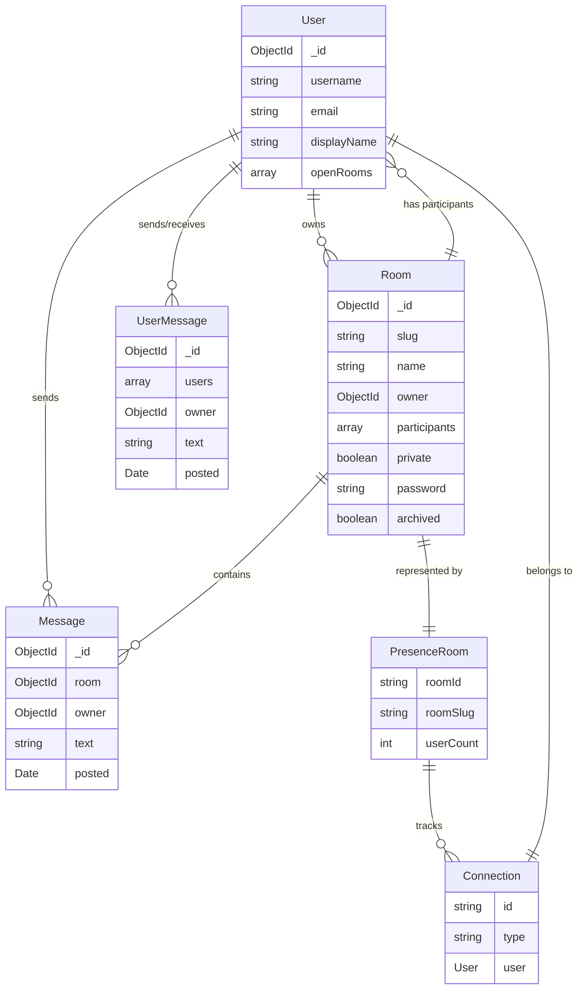
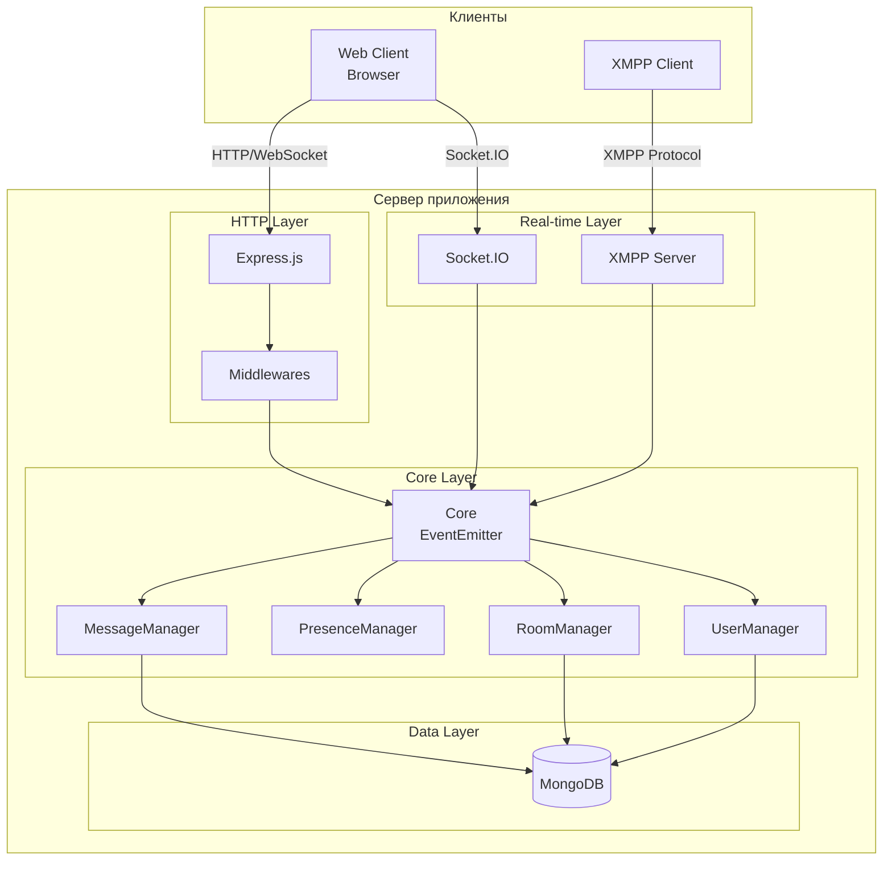
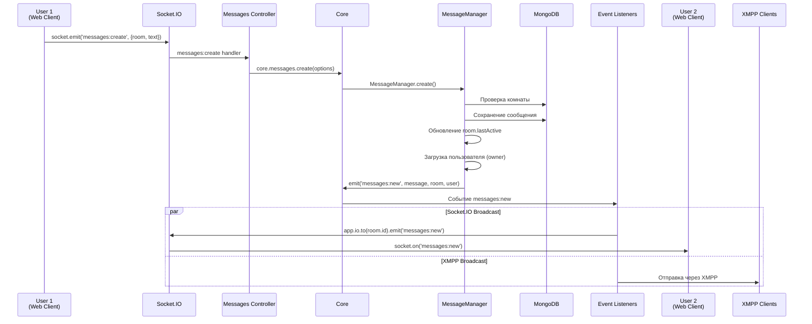
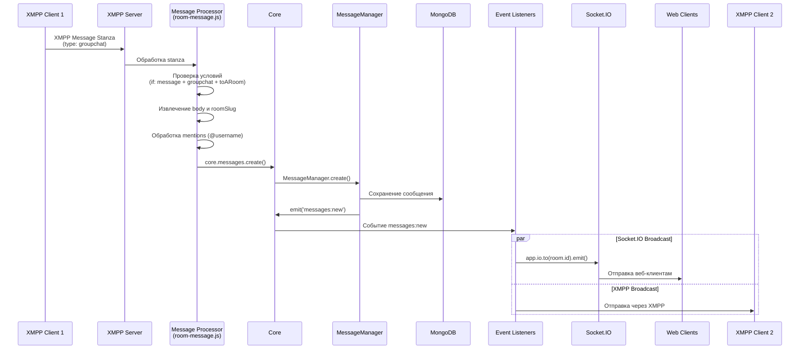
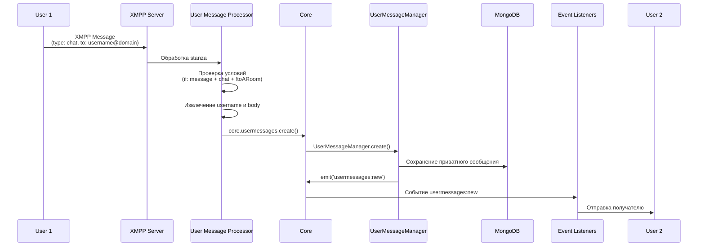
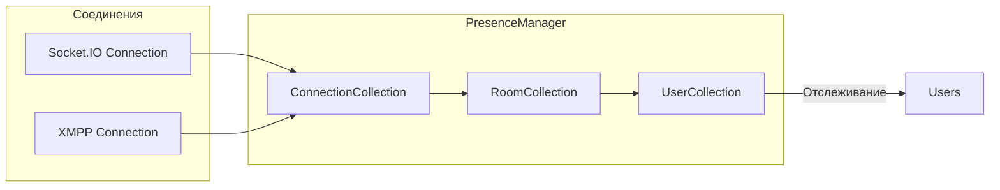

# Анализ архитектуры Let's Chat

## Общее описание

Let's Chat — это самохостируемое чат-приложение для небольших команд, построенное на Node.js. Приложение поддерживает два основных протокола для обмена сообщениями:
- **Socket.IO** — для веб-клиентов
- **XMPP (Multi-User Chat)** — для XMPP-клиентов и интеграций

## Технологический стек

### Backend
- **Node.js** — серверная платформа
- **Express.js** — веб-фреймворк
- **Socket.IO** (через express.oi) — real-time коммуникация
- **XMPP Server** (node-xmpp-server) — XMPP протокол
- **MongoDB** (Mongoose) — база данных
- **EventEmitter** — система событий

### Frontend
- **Backbone.js** — MVC фреймворк
- **jQuery** — DOM манипуляции
- **Handlebars** — шаблонизация
- **Socket.IO Client** — клиентская часть Socket.IO

## Ключевые понятия Let's Chat

### Основные сущности

#### Room (Комната)
**Файл**: `app/models/room.js`

Комната — это основной контейнер для групповых сообщений. Каждая комната имеет:

- **slug** — уникальный URL-friendly идентификатор (только строчные буквы, цифры, дефисы и подчеркивания)
- **name** — отображаемое название комнаты
- **description** — описание комнаты
- **owner** — владелец комнаты (создатель)
- **participants** — массив участников (для приватных комнат)
- **private** — флаг приватности (true/false)
- **password** — хеш пароля для защищенных комнат
- **archived** — флаг архивирования (архивированные комнаты скрыты)
- **lastActive** — дата последней активности (обновляется при каждом сообщении)
- **created** — дата создания

**Типы комнат:**
- **Публичная** (`private: false`, `password: null`) — доступна всем пользователям
- **Приватная** (`private: true`) — доступна только владельцу и участникам из списка `participants`
- **Защищенная паролем** (`password: hash`) — требует пароль для входа, но доступна всем, кто знает пароль

**Методы:**
- `isAuthorized(userId)` — проверяет, имеет ли пользователь доступ к комнате
- `canJoin(options, cb)` — проверяет возможность присоединения (с учетом пароля)

#### User (Пользователь)
**Файл**: `app/models/user.js`

Пользователь системы с аутентификацией:

- **username** — уникальное имя пользователя (строчные буквы, используется в mentions)
- **email** — уникальный email адрес
- **displayName** — отображаемое имя (обычно firstName + lastName)
- **firstName, lastName** — имя и фамилия
- **password** — хеш пароля (только для локальных пользователей)
- **provider** — провайдер аутентификации (`local`, `ldap`, `kerberos`)
- **token** — токен для API аутентификации
- **openRooms** — массив ID комнат, которые пользователь хочет открывать автоматически
- **avatar** — виртуальное поле, генерируемое из MD5 хеша email (для Gravatar)

**Особенности:**
- Поддерживает несколько провайдеров аутентификации
- Виртуальное поле `local` определяет, является ли пользователь локальным
- Метод `generateToken()` создает токен для API доступа

#### Message (Сообщение в комнате)
**Файл**: `app/models/message.js`

Сообщение в групповой комнате:

- **room** — ссылка на Room (ObjectId)
- **owner** — ссылка на User, отправителя (ObjectId)
- **text** — текст сообщения
- **posted** — дата и время отправки

**Особенности:**
- Индексируется для полнотекстового поиска (`$text` индекс)
- При сериализации в JSON включает данные владельца и комнаты

#### UserMessage (Приватное сообщение)
**Файл**: `app/models/usermessage.js`

Приватное сообщение между двумя пользователями:

- **users** — массив из двух ObjectId (отправитель и получатель)
- **owner** — отправитель сообщения
- **text** — текст сообщения
- **posted** — дата отправки

**Особенности:**
- Поддерживает OTR (Off-The-Record) сообщения (начинаются с `?OTR`)
- OTR сообщения не сохраняются в базе данных
- Может иметь TTL (time-to-live) для автоматического удаления через определенное время
- Индексируется по `users` и `posted` для быстрого поиска истории переписки

### Система Presence (Присутствие)

#### Connection (Соединение)
**Файл**: `app/core/presence/connection.js`

Активное соединение пользователя с сервером:

- **type** — тип соединения (`socket.io` или `xmpp`)
- **id** — уникальный UUID соединения
- **user** — объект пользователя

**Особенности:**
- Один пользователь может иметь несколько соединений (например, веб-браузер + XMPP клиент)
- При отключении генерируется событие `disconnect`

#### Presence Room (Комната присутствия)
**Файл**: `app/core/presence/room.js`

Виртуальная комната для отслеживания присутствия пользователей:

- **roomId** — ID комнаты из MongoDB (или undefined для системной комнаты)
- **roomSlug** — slug комнаты
- **connections** — коллекция активных соединений в этой комнате
- **userCount** — количество уникальных пользователей в комнате

**Типы:**
- **Обычная комната** — соответствует комнате из MongoDB, отслеживает пользователей в конкретной комнате
- **Системная комната** (`system: true`) — отслеживает всех онлайн пользователей

**Методы:**
- `getUsers()` — возвращает список пользователей
- `getUserIds()` — возвращает массив ID пользователей
- `getUsernames()` — возвращает массив username
- `containsUser(userId)` — проверяет наличие пользователя
- `addConnection(connection)` — добавляет соединение
- `removeConnection(connection)` — удаляет соединение

#### PresenceManager
**Файл**: `app/core/presence.js`

Менеджер системы присутствия:

- **connections** — коллекция всех активных соединений
- **rooms** — коллекция комнат присутствия
- **users** — коллекция пользователей
- **system** — системная комната (все онлайн пользователи)

**Функции:**
- Отслеживание подключений/отключений
- Управление участниками комнат
- Генерация событий `presence:user_join` и `presence:user_leave`

### XMPP понятия

#### JID (Jabber ID)
**Файл**: `app/xmpp/xmpp-connection.js`

Идентификатор в XMPP протоколе, формат: `username@domain/resource`

**Типы JID:**
- **User JID**: `username@domain` — идентификатор пользователя
- **Room JID**: `room-slug@conference.domain/username` — идентификатор пользователя в комнате
- **Conference Domain**: `conference.domain` — домен для групповых чатов

**Методы XmppConnection:**
- `getUserJid(username)` — формирует JID пользователя
- `getRoomJid(roomSlug, username)` — формирует JID комнаты
- `jid(room)` — возвращает JID текущего соединения

#### Stanza
**Файл**: `app/xmpp/msg-processor.js`

Единица данных в XMPP протоколе. Основные типы:

- **message** — сообщение (типы: `chat`, `groupchat`)
- **presence** — статус присутствия
- **iq** (Info/Query) — запрос-ответ для получения информации

**Message Processors:**
Обрабатывают входящие XMPP stanza и преобразуют их в действия системы:
- `room-message.js` — сообщения в комнаты
- `user-message.js` — приватные сообщения
- `room-join.js` — присоединение к комнате
- `room-leave.js` — выход из комнаты
- и другие...

### Другие важные понятия

#### Slug
URL-friendly идентификатор комнаты. Используется вместо ID для более читаемых URL:
- Формат: только строчные буквы, цифры, дефисы и подчеркивания (`/^[a-z0-9_-]+$/i`)
- Пример: `general`, `dev-team`, `project_alpha`
- Используется в XMPP: `room-slug@conference.domain`

#### Owner (Владелец)
Пользователь, создавший комнату:
- Имеет полные права на управление комнатой
- Может изменять настройки приватной комнаты
- Не может быть удален из списка участников

#### Participant (Участник)
Пользователь, добавленный в приватную комнату:
- Хранится в массиве `room.participants`
- Имеет доступ к приватной комнате
- Может быть добавлен/удален владельцем

#### Archive (Архивирование)
Процесс скрытия комнаты:
- Устанавливается флаг `archived: true`
- Архивированные комнаты не отображаются в списке
- Сообщения сохраняются, но комната недоступна для новых сообщений

#### Mention (Упоминание)
Упоминание пользователя в сообщении:
- Формат: `@username` или `@all`
- В XMPP: `username:` преобразуется в `@username` (если пользователь онлайн)
- Обрабатывается на уровне процессоров сообщений

#### Open Rooms
**Файл**: `app/models/user.js` (поле `openRooms`)

Массив ID комнат, которые пользователь хочет открывать автоматически при входе:
- Сохраняется в профиле пользователя
- Восстанавливается при подключении клиента
- Позволяет автоматически присоединяться к часто используемым комнатам

#### Transcript (Транскрипт)
История сообщений комнаты:
- Может быть экспортирована в различных форматах
- Поддерживает поиск по тексту (MongoDB text search)
- Ограничена по количеству сообщений (по умолчанию 500)

### Схема связей между понятиями



## Архитектура системы



## Компоненты системы

### 1. Core (Ядро приложения)
**Файл**: `app/core/index.js`

Центральный компонент, использующий EventEmitter для координации между модулями:
- `MessageManager` — управление сообщениями
- `PresenceManager` — управление присутствием пользователей
- `RoomManager` — управление комнатами
- `UserManager` — управление пользователями
- `FileManager` — управление файлами
- `AccountManager` — управление аккаунтами

### 2. Controllers (Контроллеры)
**Директория**: `app/controllers/`

Обрабатывают HTTP запросы и Socket.IO события:
- `messages.js` — API для сообщений
- `rooms.js` — API для комнат
- `users.js` — API для пользователей
- `files.js` — API для файлов

### 3. XMPP Layer
**Директория**: `app/xmpp/`

Обрабатывает XMPP протокол:
- `index.js` — инициализация XMPP сервера
- `msg-processors/` — процессоры XMPP сообщений
- `events/` — обработчики событий для отправки через XMPP
- `xmpp-connection.js` — обертка для XMPP соединений

### 4. Models (Модели данных)
**Директория**: `app/models/`

Mongoose схемы:
- `Message` — сообщения в комнатах
- `UserMessage` — приватные сообщения
- `Room` — комнаты
- `User` — пользователи
- `File` — загруженные файлы

## Поток сообщения от одного участника другому

### Сценарий 1: Сообщение через Web Client (Socket.IO)



**Детальный поток:**

1. **Клиент отправляет сообщение** (`media/js/client.js:295-296`)
   ```javascript
   Client.prototype.sendMessage = function(message) {
       this.socket.emit('messages:create', message);
   };
   ```

2. **Socket.IO обработчик** (`app/controllers/messages.js:46-59`)
   - Принимает событие `messages:create`
   - Извлекает параметры: `room`, `text`, `owner`
   - Вызывает `core.messages.create()`

3. **MessageManager.create()** (`app/core/messages.js:11-55`)
   - Проверяет существование комнаты
   - Проверяет права доступа
   - Создает сообщение в MongoDB
   - Обновляет `room.lastActive`
   - Загружает данные пользователя
   - Генерирует событие `messages:new`

4. **Обработка события messages:new** (`app/controllers/messages.js:13-20`)
   - Форматирует сообщение в JSON
   - Отправляет через Socket.IO в комнату: `app.io.to(room.id).emit('messages:new', msg)`

5. **XMPP Event Listener** (`app/xmpp/events/message-created.js`)
   - Получает событие `messages:new`
   - Для каждого XMPP соединения в комнате:
     - Форматирует сообщение в XMPP stanza
     - Отправляет через XMPP клиент

6. **Получение сообщения клиентами**
   - **Web клиенты**: получают через `socket.on('messages:new')` (`media/js/client.js:489-491`)
   - **XMPP клиенты**: получают XMPP message stanza

### Сценарий 2: Сообщение через XMPP Client



**Детальный поток:**

1. **XMPP клиент отправляет сообщение**
   - Отправляет XMPP stanza типа `message` с `type="groupchat"`
   - Адрес: `room-slug@conference.domain/username`

2. **XMPP Server обработка** (`app/xmpp/index.js:58-62`)
   - Получает stanza через событие `stanza`
   - Пробует обработать через процессоры из `msg-processors/`

3. **Message Processor** (`app/xmpp/msg-processors/room-message.js`)
   - Проверяет условия: `message` + `groupchat` + адресован в комнату
   - Извлекает `body` и `roomSlug` из stanza
   - Обрабатывает mentions (заменяет `username:` на `@username`)
   - Вызывает `core.messages.create()`

4. **Дальнейший поток аналогичен Сценарию 1**
   - Сохранение в MongoDB
   - Генерация события `messages:new`
   - Распространение через Socket.IO и XMPP

### Сценарий 3: Приватное сообщение (User-to-User)



**Особенности приватных сообщений:**
- Обрабатываются через `app/xmpp/msg-processors/user-message.js`
- Сохраняются в модель `UserMessage` (не `Message`)
- Требуют включения `settings.private.enable`
- Отправляются напрямую получателю через XMPP

## Система Presence (Присутствие)



**Компоненты:**
- `ConnectionCollection` — все активные соединения
- `RoomCollection` — пользователи в комнатах
- `UserCollection` — информация о пользователях

**Функции:**
- Отслеживание онлайн/оффлайн статуса
- Управление участниками комнат
- Распространение событий join/leave

## Модель данных

### Message Schema
```javascript
{
    room: ObjectId,      // Ссылка на Room
    owner: ObjectId,      // Ссылка на User
    text: String,        // Текст сообщения
    posted: Date         // Время отправки
}
```

### Room Schema
```javascript
{
    name: String,         // Название комнаты
    slug: String,        // URL-friendly идентификатор
    description: String, // Описание
    private: Boolean,    // Приватная комната
    password: String,    // Пароль (хеш)
    lastActive: Date     // Последняя активность
}
```

## Ключевые файлы и их роли

| Файл | Роль |
|------|------|
| `app.js` | Точка входа, инициализация Express, Socket.IO, XMPP |
| `app/core/index.js` | Ядро приложения, EventEmitter для координации |
| `app/core/messages.js` | Логика создания и получения сообщений |
| `app/controllers/messages.js` | HTTP/Socket.IO API для сообщений |
| `app/xmpp/index.js` | Инициализация XMPP сервера |
| `app/xmpp/msg-processors/room-message.js` | Обработка сообщений в комнаты через XMPP |
| `app/xmpp/msg-processors/user-message.js` | Обработка приватных сообщений через XMPP |
| `app/xmpp/events/message-created.js` | Отправка сообщений через XMPP при создании |
| `media/js/client.js` | Клиентская логика (Backbone) |

## Особенности реализации

### 1. Двойной протокол
Приложение поддерживает два протокола одновременно:
- **Socket.IO** — для веб-интерфейса
- **XMPP** — для внешних клиентов и интеграций

### 2. Event-Driven Architecture
Используется EventEmitter для слабой связанности компонентов:
- Создание сообщения генерирует событие `messages:new`
- Разные слушатели обрабатывают это событие независимо

### 3. Presence Management
Система отслеживает:
- Активные соединения (Socket.IO и XMPP)
- Участников комнат
- Статусы пользователей

### 4. Обработка Mentions
- В XMPP: `username:` → `@username` (если пользователь онлайн)
- В веб: `@username` обрабатывается на клиенте

### 5. Безопасность
- Проверка прав доступа к комнатам
- Проверка паролей для защищенных комнат
- Валидация данных перед сохранением

## Потенциальные улучшения

1. **Масштабируемость**: Текущая архитектура не поддерживает горизонтальное масштабирование (все соединения на одном сервере)
2. **Кэширование**: Отсутствует кэширование часто запрашиваемых данных
3. **Очереди**: Нет системы очередей для обработки сообщений при высокой нагрузке
4. **Шардирование**: MongoDB не настроена на шардирование

## Заключение

Let's Chat использует гибридную архитектуру с поддержкой двух протоколов (Socket.IO и XMPP), что обеспечивает гибкость для различных типов клиентов. Центральное ядро на основе EventEmitter обеспечивает слабую связанность компонентов и легкость расширения функциональности.

