# Архитектура Prosody IM Server

## Обзор

Prosody - это XMPP (Jabber) сервер, написанный на Lua. Он обеспечивает обмен сообщениями в реальном времени между пользователями через протокол XMPP.

## Ключевые понятия

### JID (Jabber ID)
JID - это уникальный идентификатор пользователя в XMPP сети. Формат: `node@domain/resource`
- **node** (username) - имя пользователя
- **domain** (host) - домен сервера
- **resource** - идентификатор клиента/устройства пользователя

Примеры:
- `user@example.com` - bare JID (без resource)
- `user@example.com/phone` - full JID (с resource)

### Stanza (Станза)
Stanza - это базовый XML элемент в XMPP протоколе. Существует три типа:
- **message** - сообщения между пользователями
- **presence** - информация о статусе пользователя (онлайн/офлайн)
- **iq** (Info/Query) - запросы и ответы для получения информации

### Session (Сессия)
Сессия представляет активное соединение клиента с сервером. Может быть:
- **c2s** (client-to-server) - соединение клиента с сервером
- **s2s** (server-to-server) - соединение между серверами
- **s2sin** - входящее s2s соединение
- **s2sout** - исходящее s2s соединение

### Host (Хост)
Host - это виртуальный домен, который обслуживает Prosody. Может быть:
- **VirtualHost** - домен для пользователей
- **Component** - специальный сервис (например, MUC для групповых чатов)

### Resource (Ресурс)
Ресурс идентифицирует конкретное устройство/клиент пользователя. Один пользователь может иметь несколько ресурсов одновременно (например, телефон и компьютер).

### Roster (Ростер)
Ростер - это список контактов пользователя, аналог списка друзей в мессенджерах.

## Архитектура системы

### Основные компоненты

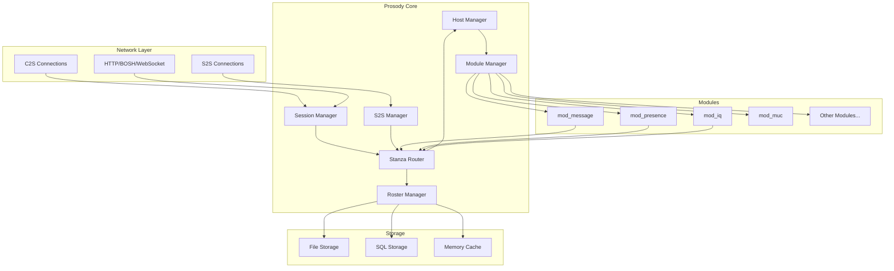

## Поток обработки сообщения

### Сценарий 1: Сообщение между пользователями одного сервера

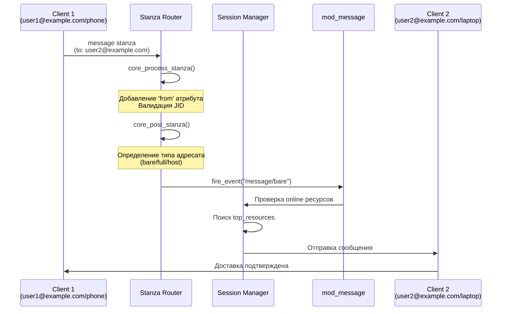

### Сценарий 2: Сообщение между пользователями разных серверов

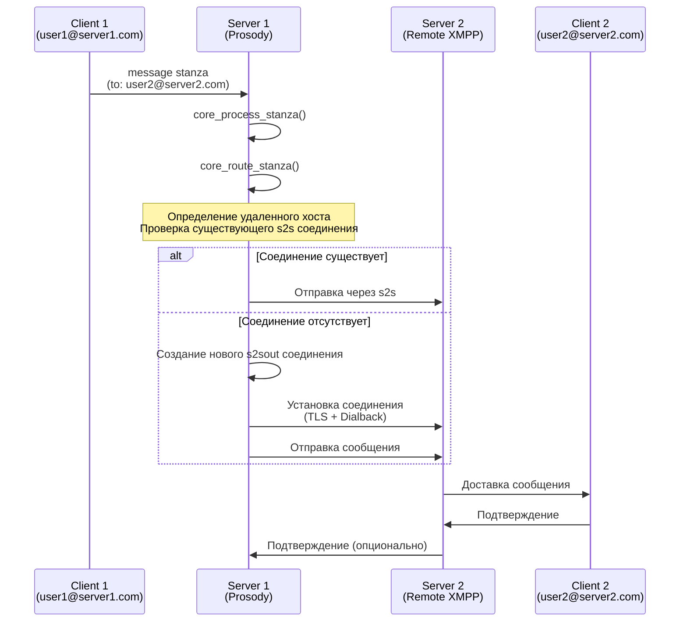

### Сценарий 3: Сообщение на full JID

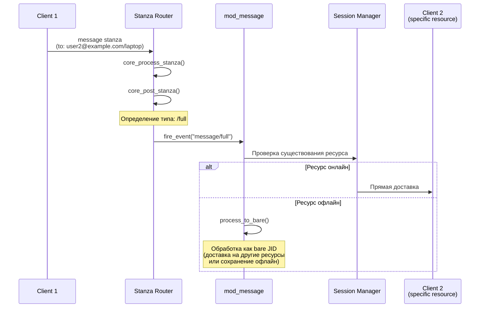

## Детальная архитектура маршрутизации

### Функции маршрутизации

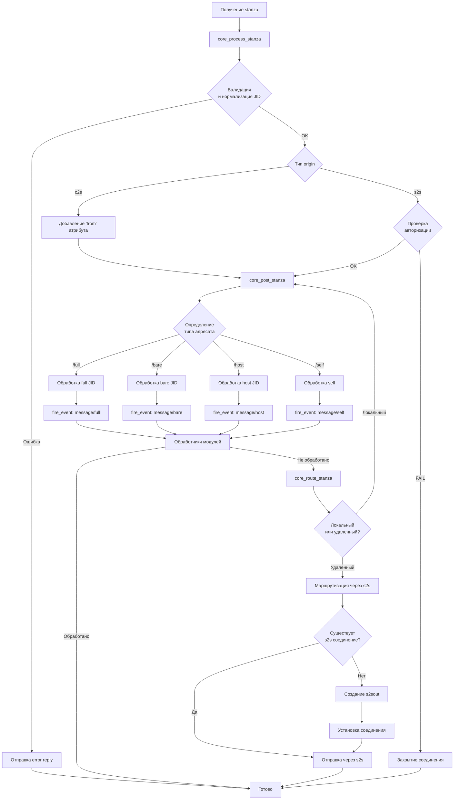

## Управление сессиями

### Жизненный цикл c2s сессии

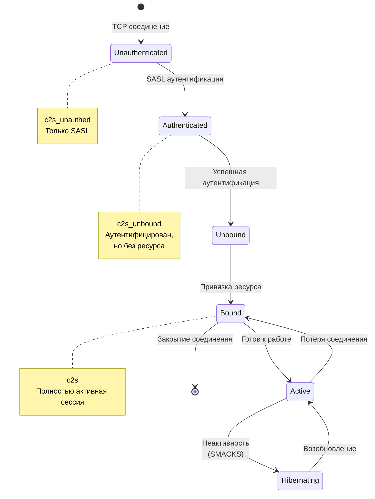

### Структура данных сессий

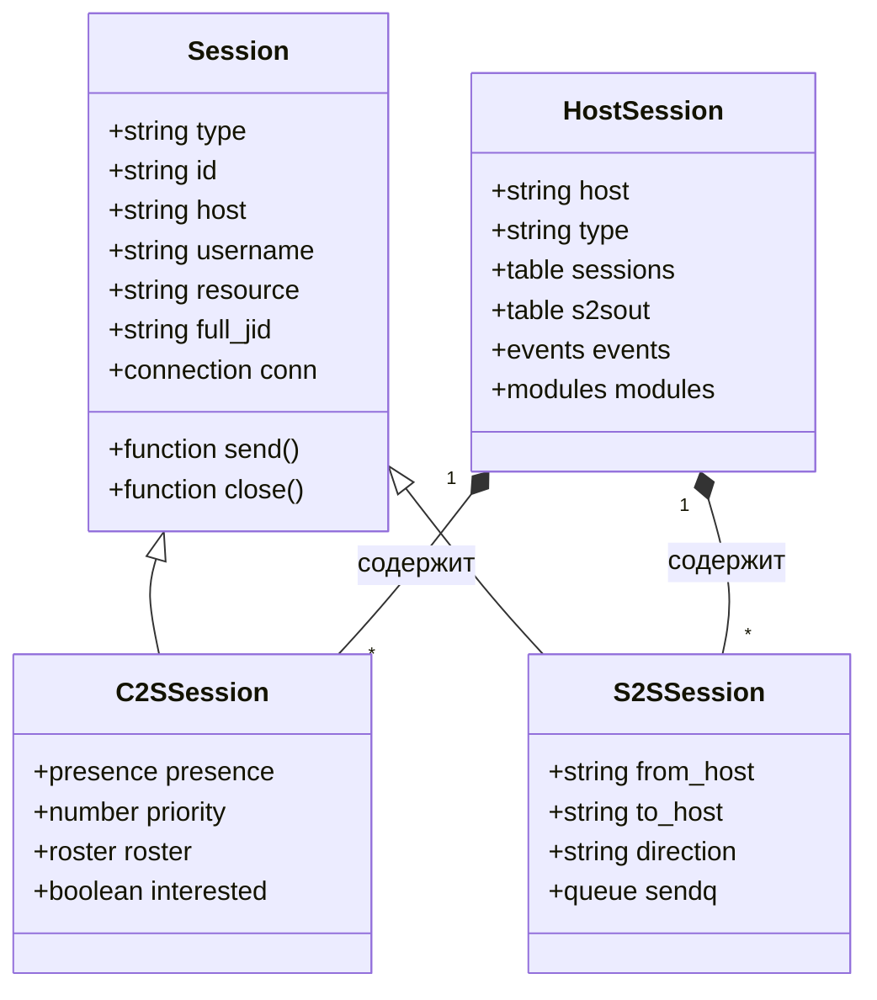

## Модульная система

### Загрузка модулей

```mermaid
graph LR
    START[Старт сервера] --> LOAD_CONFIG[Загрузка конфигурации]
    LOAD_CONFIG --> ACTIVATE_HOST[Активация хостов]
    ACTIVATE_HOST --> LOAD_MODULES[Загрузка модулей]
    
    LOAD_MODULES --> CHECK_GLOBAL{Глобальный<br/>модуль?}
    CHECK_GLOBAL -->|Да| GLOBAL_ENV[Создание глобального окружения]
    CHECK_GLOBAL -->|Нет| HOST_ENV[Создание host окружения]
    
    GLOBAL_ENV --> LOAD_CODE[Загрузка кода модуля]
    HOST_ENV --> LOAD_CODE
    
    LOAD_CODE --> CALL_LOAD[Вызов module.load]
    CALL_LOAD --> HOOK_EVENTS[Регистрация обработчиков событий]
    HOOK_EVENTS --> READY[Модуль готов]
    
    READY --> CALL_READY{Есть<br/>module.ready?}
    CALL_READY -->|Да| READY_HOOK[Вызов module.ready]
    CALL_READY -->|Нет| DONE[Готово]
    READY_HOOK --> DONE
```

### Обработка событий

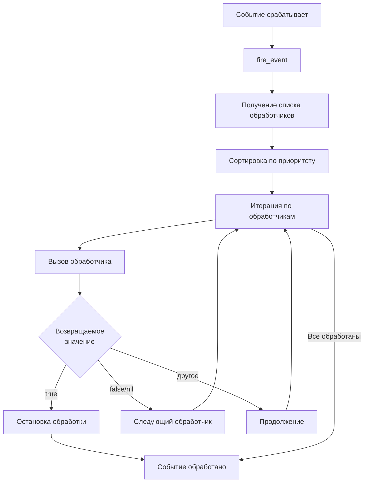

## Хранение данных

### Структура хранилища

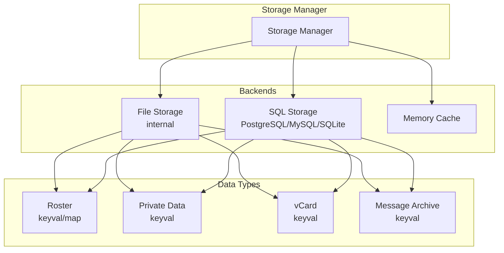

## Безопасность

### Аутентификация и авторизация

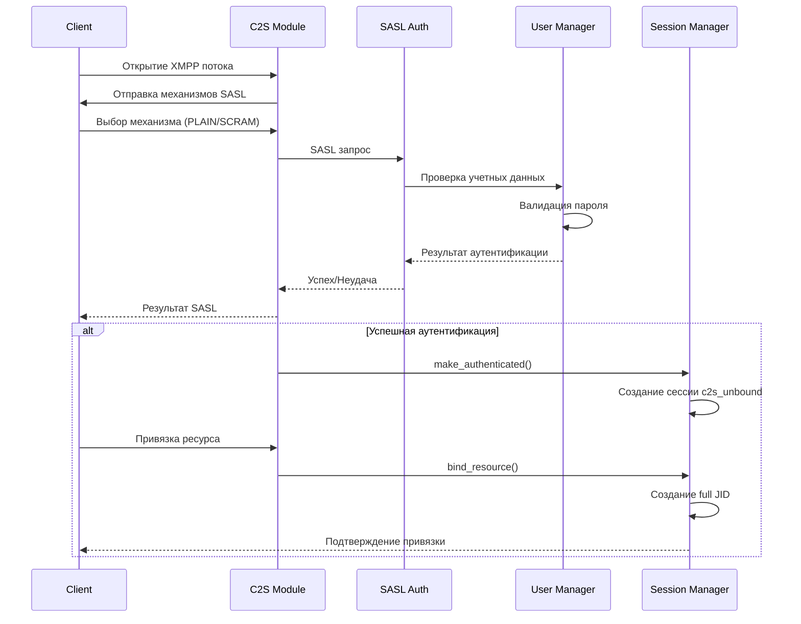

## Производительность и оптимизация

### Кэширование

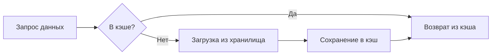

### Приоритет ресурсов

При доставке сообщения на bare JID, Prosody выбирает "лучший" ресурс на основе:
1. Приоритета (priority) - выше = лучше
2. Наличия presence - только онлайн ресурсы
3. Порядка подключения - при равном приоритете

## Расширяемость

### Создание модуля

Модули могут:
- Перехватывать события (hook)
- Обрабатывать stanza определенных типов
- Добавлять новые функции в API
- Расширять протокол XMPP

### Типы событий

- `stanza/message/bare` - сообщение на bare JID
- `stanza/message/full` - сообщение на full JID
- `stanza/presence/bare` - presence на bare JID
- `stanza/iq/...` - IQ запросы
- `pre-stanza` - до обработки stanza
- `route/remote` - маршрутизация на удаленный сервер

## Заключение

Prosody использует модульную архитектуру с четким разделением ответственности:
- **Core** - базовые функции (маршрутизация, сессии, хосты)
- **Modules** - расширяемая функциональность
- **Storage** - абстракция над хранилищами данных
- **Network** - обработка сетевых соединений

Такая архитектура обеспечивает гибкость, расширяемость и простоту поддержки.
