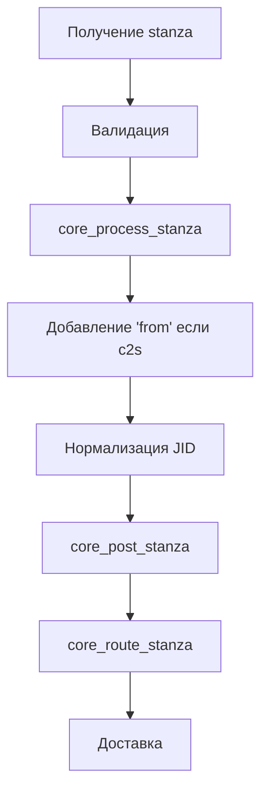

# Ключевые понятия Prosody

## JID (Jabber ID)

### Структура JID

JID состоит из трех частей: `node@domain/resource`

- **node** (узел) - имя пользователя или сервиса
- **domain** (домен) - доменное имя сервера
- **resource** (ресурс) - идентификатор клиента/устройства

### Типы JID

#### Bare JID
Формат: `user@example.com`
- Используется для идентификации пользователя в целом
- Не содержит resource
- Используется для подписок, ростеров, адресации сообщений

#### Full JID
Формат: `user@example.com/phone`
- Полная идентификация конкретного клиента
- Один пользователь может иметь несколько full JID одновременно
- Используется для прямой доставки сообщений на конкретное устройство

#### Host JID
Формат: `example.com`
- Идентифицирует сам сервер
- Используется для администрирования и сервисных запросов

### Нормализация JID

Prosody выполняет нормализацию JID согласно RFC 6122:
- **nodeprep** - нормализация node части
- **nameprep** - нормализация domain части  
- **resourceprep** - нормализация resource части

## Stanza (Станза)

### Типы Stanza

#### Message
Используется для отправки сообщений между пользователями.

Атрибуты:
- `to` - получатель
- `from` - отправитель
- `type` - тип сообщения (normal, chat, groupchat, headline, error)
- `id` - уникальный идентификатор (опционально)

Типы сообщений:
- **normal** - обычное сообщение
- **chat** - чат-сообщение
- **groupchat** - сообщение в групповом чате
- **headline** - новостное сообщение (не требует ответа)
- **error** - сообщение об ошибке

#### Presence
Используется для передачи статуса пользователя.

Атрибуты:
- `to` - получатель (опционально, для broadcast)
- `from` - отправитель
- `type` - тип presence (unavailable, subscribe, subscribed, unsubscribe, unsubscribed, probe)

Типы presence:
- **available** (по умолчанию) - пользователь онлайн
- **unavailable** - пользователь офлайн
- **subscribe** - запрос на подписку
- **subscribed** - подтверждение подписки
- **unsubscribe** - отписка
- **unsubscribed** - подтверждение отписки
- **probe** - запрос статуса

Элементы presence:
- `<show/>` - статус (away, chat, dnd, xa)
- `<status/>` - текстовый статус
- `<priority/>` - приоритет ресурса (число от -128 до 127)

#### IQ (Info/Query)
Используется для запросов и ответов.

Атрибуты:
- `to` - получатель
- `from` - отправитель
- `type` - тип IQ (get, set, result, error)
- `id` - обязательный уникальный идентификатор

Типы IQ:
- **get** - запрос информации
- **set** - установка/изменение данных
- **result** - успешный ответ
- **error** - ответ с ошибкой

### Обработка Stanza



## Session (Сессия)

### Типы сессий

#### C2S (Client-to-Server)
Соединение клиента с сервером.

Состояния:
1. **c2s_unauthed** - не аутентифицирован
2. **c2s_unbound** - аутентифицирован, но без ресурса
3. **c2s** - полностью активная сессия

Свойства:
- `username` - имя пользователя
- `host` - домен
- `resource` - идентификатор ресурса
- `full_jid` - полный JID сессии
- `presence` - текущий presence
- `priority` - приоритет ресурса
- `roster` - ростер пользователя

#### S2S (Server-to-Server)
Соединение между серверами.

Типы:
- **s2sin** - входящее соединение
- **s2sout** - исходящее соединение

Свойства:
- `from_host` - домен отправителя
- `to_host` - домен получателя
- `direction` - направление (incoming/outgoing)
- `hosts` - список авторизованных доменов
- `sendq` - очередь отправки

### Управление сессиями

#### Full Sessions
Хранилище: `prosody.full_sessions[full_jid] = session`
- Быстрый поиск по full JID
- Используется для доставки на конкретный ресурс

#### Bare Sessions
Хранилище: `prosody.bare_sessions[bare_jid] = { sessions = {...} }`
- Хранит все ресурсы пользователя
- Используется для доставки на bare JID

### Приоритет ресурсов

При доставке сообщения на bare JID выбирается "лучший" ресурс:

1. **Приоритет** - ресурсы с более высоким priority предпочтительнее
2. **Presence** - только ресурсы с presence >= 0
3. **Порядок** - при равном приоритете выбирается первый подключенный

```lua
-- Пример структуры bare_sessions
bare_sessions["user@example.com"] = {
    sessions = {
        ["phone"] = { priority = 10, presence = true },
        ["laptop"] = { priority = 5, presence = true },
        ["tablet"] = { priority = 0, presence = true }
    },
    top_resources = { phone_session, laptop_session, tablet_session } -- отсортированы по приоритету
}
```

## Host (Хост)

### VirtualHost
Виртуальный домен для пользователей.

Свойства:
- `host` - доменное имя
- `type` - "local"
- `sessions` - активные сессии пользователей
- `s2sout` - исходящие s2s соединения
- `events` - система событий
- `modules` - загруженные модули

### Component
Специальный сервис на отдельном домене.

Типы компонентов:
- **muc** - Multi-User Chat (групповые чаты)
- **http_file_share** - обмен файлами
- **gateway** - шлюзы к другим протоколам

Свойства:
- `host` - доменное имя компонента
- `type` - "component"
- `component_module` - тип компонента

## Roster (Ростер)

### Структура ростра

Ростер - это список контактов пользователя.

```lua
roster = {
    ["contact@example.com"] = {
        subscription = "both",  -- both, to, from, none
        name = "Contact Name",
        groups = { "Friends", "Work" },
        ask = nil,  -- "subscribe" если ожидается ответ
        approved = nil  -- "true" если предварительно одобрен
    },
    [false] = {  -- метаданные
        version = 1,
        pending = {}  -- ожидающие подписки
    }
}
```

### Типы подписок

- **none** - нет подписки
- **to** - пользователь подписан на контакт
- **from** - контакт подписан на пользователя
- **both** - взаимная подписка

### Roster Push

При изменении ростра все онлайн ресурсы получают обновление через IQ set:

```xml
<iq type="set" id="...">
    <query xmlns="jabber:iq:roster" ver="1">
        <item jid="contact@example.com" subscription="both" name="Contact"/>
    </query>
</iq>
```

## Events (События)

### Система событий

Prosody использует систему событий для связи между модулями.

### Типы событий

#### Stanza Events
- `stanza/message/bare` - сообщение на bare JID
- `stanza/message/full` - сообщение на full JID
- `stanza/presence/bare` - presence на bare JID
- `stanza/presence/full` - presence на full JID
- `stanza/iq/...` - IQ запросы

#### Pre-Events
- `pre-stanza` - до обработки любой stanza
- `pre-message/bare` - до обработки message/bare
- `pre-presence/bare` - до обработки presence/bare

#### Routing Events
- `route/remote` - маршрутизация на удаленный сервер

#### Session Events
- `resource-bind` - привязка ресурса
- `resource-unbind` - отвязка ресурса
- `c2s-authenticated` - успешная аутентификация
- `s2s-authenticated` - успешная s2s аутентификация

### Приоритеты обработчиков

Обработчики событий могут иметь приоритет:
- Высокий приоритет обрабатывается первым
- Если обработчик возвращает `true`, обработка останавливается
- Если обработчик возвращает `false` или `nil`, обработка продолжается

## Storage (Хранилище)

### Типы хранилищ

#### Internal (File Storage)
Хранение в файлах на диске.

Структура:
```
data/
  example.com/
    accounts/
    roster/
    private/
    vcard/
```

#### SQL Storage
Хранение в базе данных (PostgreSQL, MySQL, SQLite).

Преимущества:
- Лучшая производительность для больших объемов
- Транзакции
- Резервное копирование

### Типы данных

#### keyval
Хранение ключ-значение для одного объекта.

Используется для:
- Roster (один ключ = один контакт)
- Private data
- vCard

#### map
Хранение нескольких ключ-значение пар.

Используется для:
- Roster (оптимизация при изменении одного контакта)

## Filters (Фильтры)

### Типы фильтров

#### bytes/in
Обработка входящих байтов (до парсинга XML).

#### bytes/out
Обработка исходящих байтов (после сериализации XML).

#### stanzas/in
Обработка входящих stanza (после парсинга XML).

#### stanzas/out
Обработка исходящих stanza (перед сериализацией XML).

### Использование фильтров

Фильтры используются для:
- Сжатия (XEP-0138: Stream Compression)
- Шифрования
- Модификации stanza
- Логирования

## Modules (Модули)

### Структура модуля

```lua
local module = {};

function module.load()
    -- Инициализация модуля
end

function module.unload()
    -- Очистка при выгрузке
end

module:hook("message/bare", function(event)
    -- Обработка сообщений
    return true; -- остановить обработку
end);

return module;
```

### API модулей

#### Регистрация обработчиков
- `module:hook(event, handler, priority)` - регистрация обработчика
- `module:hook_tag(xmlns, name, handler)` - обработка определенного тега
- `module:unhook(event, handler)` - удаление обработчика

#### Работа с событиями
- `module:fire_event(event, data)` - генерация события
- `module:wrap_event(event, handler)` - обертка вокруг события

#### Хранение данных
- `module:open_store(name, type)` - открытие хранилища
- `module:shared(name)` - общие данные между экземплярами

#### Конфигурация
- `module:get_option(name, default)` - получение опции
- `module:get_option_set(name, default)` - получение множества
- `module:get_option_period(name, default)` - получение периода времени

## Network (Сеть)

### Типы соединений

#### C2S (Client-to-Server)
- Порт: 5222 (обычно)
- Протокол: XMPP over TCP
- TLS: STARTTLS или прямой TLS
- Аутентификация: SASL

#### S2S (Server-to-Server)
- Порт: 5269 (обычно)
- Протокол: XMPP over TCP
- TLS: STARTTLS или прямой TLS
- Аутентификация: Dialback или SASL

#### BOSH (HTTP)
- Порт: 5280 (обычно)
- Протокол: HTTP с длинными запросами
- Используется для клиентов за прокси

#### WebSocket
- Порт: 5280 (обычно)
- Протокол: WebSocket
- Используется для веб-клиентов

### Резолвинг серверов

Для s2s соединений Prosody использует:
1. SRV записи DNS (_xmpp-server._tcp)
2. Прямое подключение к домену
3. Fallback на стандартный порт 5269
