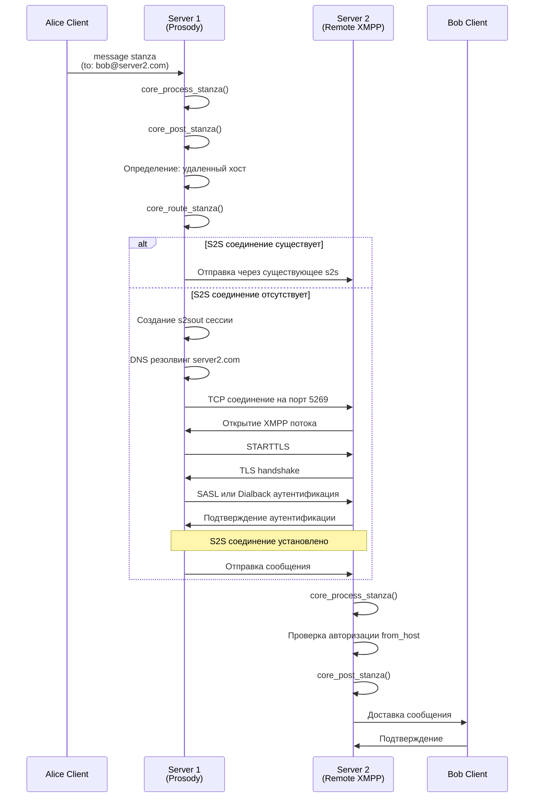
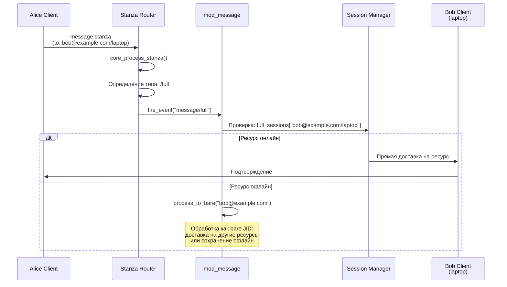
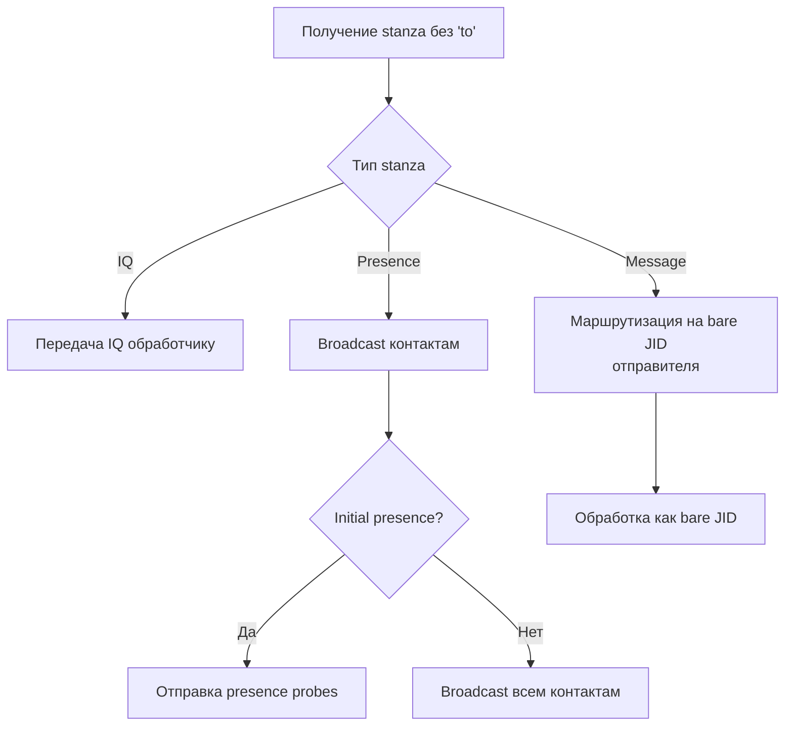
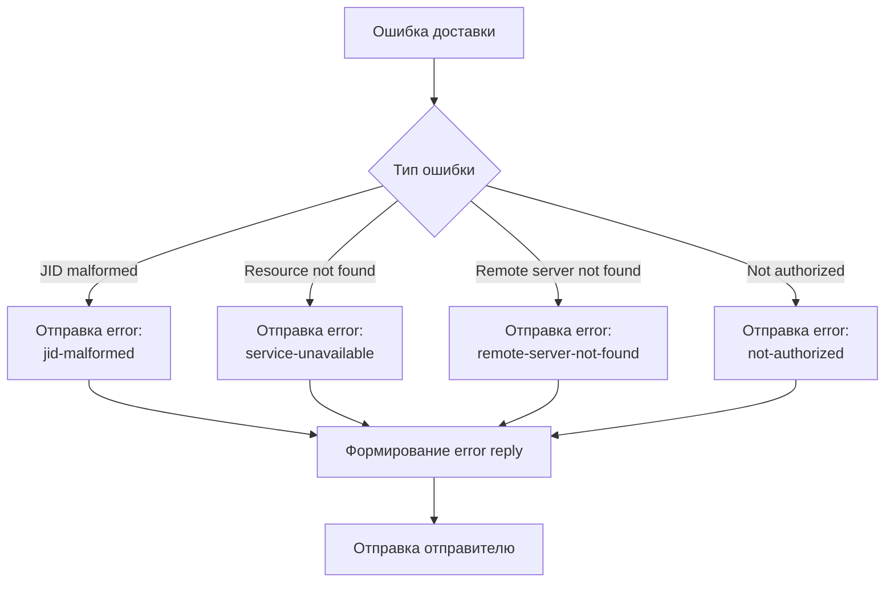

# Детальный поток обработки сообщения

## Обзор

Этот документ описывает детальный путь прохождения сообщения от одного участника к другому в Prosody.

## Сценарий 1: Локальная доставка (один сервер)

### Исходные данные
- Отправитель: `alice@example.com/phone`
- Получатель: `bob@example.com/laptop`
- Оба пользователя на одном сервере `example.com`

### Последовательность обработки

```mermaid
sequenceDiagram
    participant A as Alice Client<br/>(phone)
    participant C2S as C2S Module
    participant SR as Stanza Router
    participant MSG as mod_message
    participant SM as Session Manager
    participant B as Bob Client<br/>(laptop)
    
    Note over A: Пользователь отправляет<br/>сообщение
    
    A->>C2S: TCP/XMPP: message stanza<br/>&lt;message to="bob@example.com"&gt;
    
    Note over C2S: Получение stanza<br/>из XMPP потока
    
    C2S->>SR: core_process_stanza(origin, stanza)
    
    Note over SR: 1. Валидация stanza<br/>2. Добавление 'from' атрибута<br/>3. Нормализация JID
    
    SR->>SR: stanza.attr.from = "alice@example.com/phone"
    SR->>SR: jid_prepped_split("bob@example.com")
    
    SR->>SR: core_post_stanza(origin, stanza, true)
    
    Note over SR: Определение типа адресата:<br/>node="bob", host="example.com"<br/>resource отсутствует → /bare
    
    SR->>MSG: fire_event("message/bare", {<br/>  origin=origin,<br/>  stanza=stanza,<br/>  to_self=false<br/>})
    
    MSG->>MSG: process_to_bare("bob@example.com", origin, stanza)
    
    MSG->>SM: Проверка: bare_sessions["bob@example.com"]
    
    alt Ресурсы онлайн
        SM->>SM: Получение top_resources
        Note over SM: Выбор ресурсов с<br/>наивысшим приоритетом
        
        SM->>B: session.send(stanza)
        B->>A: Подтверждение доставки
    else Ресурсы офлайн
        MSG->>MSG: fire_event("message/offline/handle")
        Note over MSG: Сохранение в<br/>offline storage
        MSG->>A: Подтверждение сохранения
    end
```

### Детальный код обработки

#### 1. Получение stanza (core/stanza_router.lua)

```lua
function core_process_stanza(origin, stanza)
    -- Для c2s соединений добавляем 'from' атрибут
    if origin.type == "c2s" and not stanza.attr.xmlns then
        stanza.attr.from = origin.full_jid;
    end
    
    -- Нормализация JID получателя
    local to = stanza.attr.to;
    if to then
        local node, host, resource = jid_prepped_split(to);
        -- ...
        stanza.attr.to = to;
    end
    
    -- Маршрутизация
    core_post_stanza(origin, stanza, origin.full_jid);
end
```

#### 2. Определение типа адресата (core/stanza_router.lua)

```lua
function core_post_stanza(origin, stanza, preevents)
    local to = stanza.attr.to;
    local node, host, resource = jid_split(to);
    local to_bare = node and (node.."@"..host) or host;
    
    local to_type;
    if node then
        if resource then
            to_type = '/full';  -- user@host/resource
        else
            to_type = '/bare';  -- user@host
        end
    else
        if host then
            to_type = '/host';  -- host
        else
            to_type = '/bare';  -- self
        end
    end
    
    -- Генерация события
    local event = stanza.name .. to_type;  -- "message/bare"
    hosts[host].events.fire_event(event, {
        origin = origin,
        stanza = stanza
    });
end
```

#### 3. Обработка сообщения (plugins/mod_message.lua)

```lua
module:hook("message/bare", function(data)
    local origin, stanza = data.origin, data.stanza;
    local bare = stanza.attr.to;
    
    return process_to_bare(bare, origin, stanza);
end, -1);

function process_to_bare(bare, origin, stanza)
    local user = bare_sessions[bare];
    
    if user then
        -- Пользователь онлайн
        local recipients = user.top_resources;
        if recipients then
            for i=1,#recipients do
                recipients[i].send(stanza);
            end
            return true;
        end
    end
    
    -- Пользователь офлайн
    module:fire_event('message/offline/handle', {
        username = node,
        origin = origin,
        stanza = stanza,
    });
end
```

## Сценарий 2: Удаленная доставка (разные серверы)

### Исходные данные
- Отправитель: `alice@server1.com/phone`
- Получатель: `bob@server2.com/laptop`
- Разные серверы

### Последовательность обработки



### Детальный код маршрутизации

#### 1. Определение удаленного хоста (core/stanza_router.lua)

```lua
function core_route_stanza(origin, stanza)
    local to_host = jid_host(stanza.attr.to);
    local from_host = jid_host(stanza.attr.from);
    
    if hosts[to_host] then
        -- Локальный хост
        core_post_stanza(origin, stanza);
    else
        -- Удаленный хост
        local host_session = hosts[from_host];
        host_session.events.fire_event("route/remote", {
            origin = origin,
            stanza = stanza,
            from_host = from_host,
            to_host = to_host
        });
    end
end
```

#### 2. Обработка удаленной маршрутизации (plugins/mod_s2s.lua)

```lua
module:hook("route/remote", function(event)
    local from_host = event.from_host;
    local to_host = event.to_host;
    local stanza = event.stanza;
    
    -- Проверка существующего соединения
    local session = hosts[from_host].s2sout[to_host];
    
    if session and session.type == "s2sout" then
        -- Использование существующего соединения
        session.send(stanza);
        return true;
    end
    
    -- Создание нового соединения
    if not session or session.type == "s2sout_unauthed" then
        -- Инициирование соединения
        initiate_s2s_connection(from_host, to_host);
        -- Очередь stanza для отправки после установления соединения
        queue_stanza(session, stanza);
    end
end);
```

## Сценарий 3: Сообщение на full JID

### Исходные данные
- Отправитель: `alice@example.com/phone`
- Получатель: `bob@example.com/laptop` (конкретный ресурс)

### Последовательность обработки



### Код обработки full JID

```lua
module:hook("message/full", function(data)
    local origin, stanza = data.origin, data.stanza;
    
    -- Попытка доставки на конкретный ресурс
    local session = full_sessions[stanza.attr.to];
    if session and session.send(stanza) then
        return true;  -- Доставлено
    end
    
    -- Ресурс не найден, обработка как bare JID
    return process_to_bare(jid_bare(stanza.attr.to), origin, stanza);
end, -1);
```

## Сценарий 4: Сообщение без 'to' атрибута

### Обработка сообщений без указания получателя



### Код обработки (doc/stanza_routing.txt)

```
No 'to' attribute:
	IQ:			Pass to appropriate handler
	Presence:		Broadcast to contacts
				- if initial presence, also send out presence probes
					- if probe would be to local user, generate presence stanza for them
	Message:		Route as if it is addressed to the bare JID of the sender
```

## Сценарий 5: Обработка ошибок

### Типы ошибок при доставке



### Формат error reply

```xml
<message type="error" to="alice@example.com/phone" from="bob@example.com">
    <error type="cancel" condition="service-unavailable">
        <text>Resource is not available</text>
    </error>
</message>
```

## Оптимизации

### Кэширование сессий

- `full_sessions` - быстрый поиск по full JID
- `bare_sessions` - доступ ко всем ресурсам пользователя
- `top_resources` - предварительно отсортированные ресурсы по приоритету

### Очередь отправки (sendq)

Для s2s соединений используется очередь отправки:
- Станзы помещаются в очередь до установления соединения
- После установления соединения все станзы отправляются
- При ошибке соединения станзы возвращаются с error reply

### Приоритет ресурсов

Алгоритм выбора ресурса:
1. Фильтрация по presence (только онлайн)
2. Сортировка по priority (выше = лучше)
3. При равном priority - первый подключенный

## Логирование

### Точки логирования

1. **Получение stanza**: `core_process_stanza` логирует входящие станзы
2. **Маршрутизация**: `core_route_stanza` логирует решения маршрутизации
3. **Доставка**: модули логируют успешную доставку
4. **Ошибки**: все ошибки логируются с деталями

### Уровни логирования

- `debug` - детальная информация о каждом шаге
- `info` - важные события (доставка, ошибки)
- `warn` - предупреждения (неавторизованные запросы)
- `error` - критические ошибки
