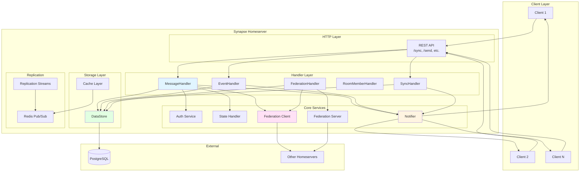
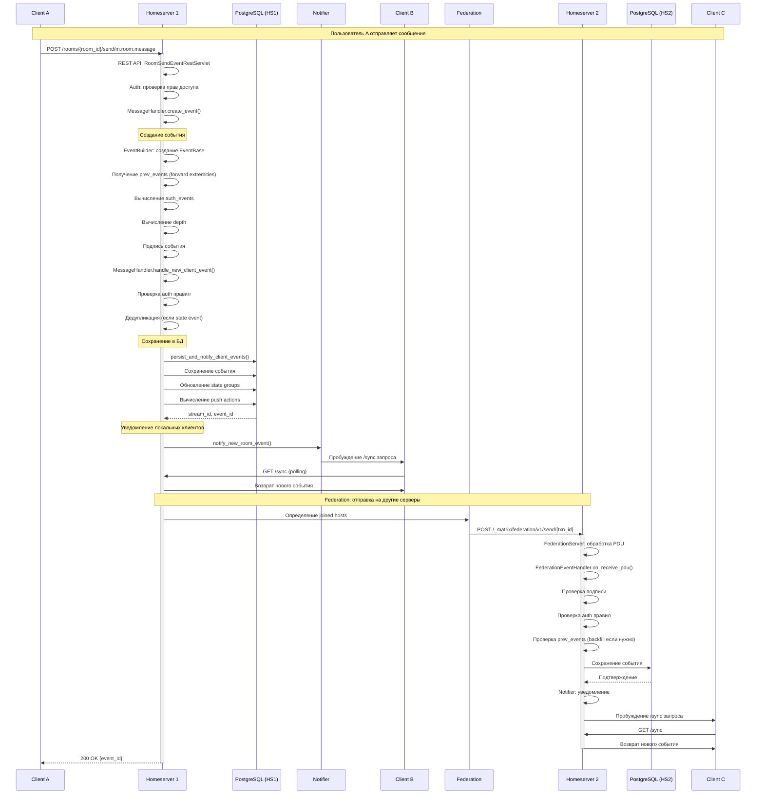
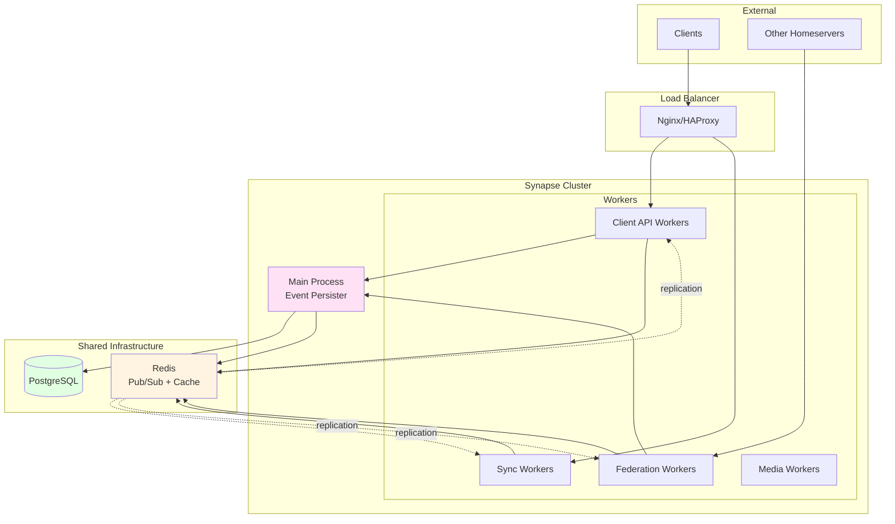
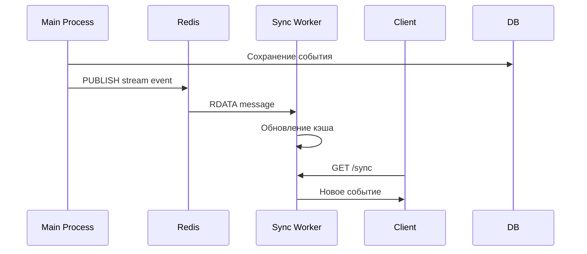

# Анализ архитектуры Synapse

## Введение

Synapse — это реализация homeserver для протокола Matrix, написанная на Python. Matrix — это открытый стандарт для децентрализованной коммуникации, поддерживающий федерацию, шифрование и VoIP.

Данный документ описывает архитектуру Synapse с особым вниманием к процессу передачи сообщений между участниками.

## Ключевые понятия

### Event (Событие)

**Event** — это основная единица данных в Matrix. События представляют собой неизменяемые (immutable) записи, которые описывают изменения в комнатах (rooms). Каждое событие имеет:
- `event_id` — уникальный идентификатор
- `room_id` — идентификатор комнаты
- `type` — тип события (например, `m.room.message`, `m.room.member`)
- `sender` — отправитель события
- `content` — содержимое события
- `prev_events` — ссылки на предыдущие события (формируют DAG)
- `auth_events` — события, необходимые для авторизации
- `depth` — глубина в графе событий

### Room (Комната)

**Room** — это виртуальное пространство, где участники обмениваются событиями. Комната имеет:
- Уникальный `room_id`
- Версию протокола комнаты (`room_version`)
- Граф событий (DAG — Directed Acyclic Graph)
- Текущее состояние (state), определяемое последними state-событиями

### Homeserver

**Homeserver** — это сервер, который управляет пользователями и комнатами. Каждый homeserver:
- Хранит данные своих пользователей
- Управляет комнатами, созданными на этом сервере
- Обменивается событиями с другими homeservers через федерацию

### Federation (Федерация)

**Federation** — это механизм, позволяющий homeservers обмениваться событиями друг с другом. Когда пользователь на одном сервере отправляет сообщение в комнату, где есть участники с других серверов, его homeserver отправляет событие на homeservers других участников.

### PDU (Persistent Data Unit)

**PDU** — это термин, используемый в протоколе federation для обозначения событий, передаваемых между серверами. PDU — это по сути то же самое, что и Event, но в контексте межсерверной коммуникации.

### EDU (Ephemeral Data Unit)

**EDU** — это временные данные, передаваемые между серверами (например, typing indicators, presence updates). В отличие от PDU, EDU не сохраняются в базе данных.

### State Event

**State Event** — это особый тип события, который изменяет состояние комнаты. Примеры: `m.room.member` (членство), `m.room.power_levels` (права доступа), `m.room.name` (название комнаты).

### Timeline Event

**Timeline Event** — это событие, которое появляется в истории комнаты (например, текстовые сообщения). В отличие от state events, timeline events не изменяют состояние комнаты напрямую.

### Stream

**Stream** — это механизм репликации в Synapse. Stream представляет собой append-only лог изменений в базе данных. Различные типы streams:
- Events stream — новые события
- Account data stream — изменения в account data пользователей
- To-device stream — сообщения для устройств
- И другие

### Notifier

**Notifier** — это компонент, который уведомляет подключенных клиентов о новых событиях. Когда событие сохраняется в базе данных, Notifier разбудит клиентов, ожидающих обновлений через `/sync`.

### Handler

**Handler** — это класс, который обрабатывает определенный тип операций. Например:
- `MessageHandler` — обработка сообщений
- `FederationHandler` — обработка federation запросов
- `EventHandler` — обработка событий
- `RoomMemberHandler` — обработка членства в комнатах

### Requester

**Requester** — это объект, представляющий пользователя, делающего запрос. Содержит информацию о пользователе, устройстве, аутентификации и т.д.

### EventContext

**EventContext** — это контекст события, содержащий информацию о состоянии комнаты на момент создания события. Включает:
- Предыдущее состояние (prev_state)
- Текущее состояние (current_state)
- State groups для оптимизации

## Общая архитектура



## Детальный поток сообщения между участниками

### Сценарий: Отправка сообщения в комнату

Рассмотрим сценарий, когда пользователь A на homeserver1 отправляет сообщение в комнату, где также находятся пользователи B (на homeserver1) и C (на homeserver2).



### Детальный поток обработки события

```mermaid
flowchart TD
    START([Клиент отправляет<br/>POST /send]) --> AUTH_CHECK{Проверка<br/>авторизации}
    AUTH_CHECK -->|Не авторизован| ERROR1[403 Forbidden]
    AUTH_CHECK -->|Авторизован| CREATE[MessageHandler.create_event]
    
    CREATE --> GET_PREV[Получение prev_events<br/>forward extremities]
    GET_PREV --> GET_AUTH[Вычисление auth_events<br/>из state комнаты]
    GET_AUTH --> CALC_DEPTH[Вычисление depth<br/>max prev_events depth + 1]
    CALC_DEPTH --> BUILD[EventBuilder:<br/>создание EventBase]
    BUILD --> VALIDATE[Валидация события]
    
    VALIDATE --> HANDLE[handle_new_client_event]
    HANDLE --> DEDUP{State event?}
    DEDUP -->|Да| CHECK_DEDUP[Проверка дедупликации]
    DEDUP -->|Нет| AUTH_RULES
    CHECK_DEDUP -->|Дубликат| RETURN_DUP[Возврат существующего события]
    CHECK_DEDUP -->|Новый| AUTH_RULES
    
    AUTH_RULES[Проверка auth правил<br/>event_auth.check]
    AUTH_RULES -->|Не прошло| ERROR2[403 Auth Error]
    AUTH_RULES -->|Прошло| PERSIST
    
    PERSIST[persist_and_notify_client_events]
    PERSIST --> STORE_DB[(Сохранение в БД)]
    STORE_DB --> UPDATE_STATE[Обновление state groups]
    UPDATE_STATE --> PUSH_ACTIONS[Вычисление push actions]
    PUSH_ACTIONS --> STREAM_ID[Получение stream_id]
    
    STREAM_ID --> NOTIFY_LOCAL[Notifier:<br/>уведомление локальных клиентов]
    NOTIFY_LOCAL --> FED_CHECK{Есть ли<br/>remote участники?}
    
    FED_CHECK -->|Нет| END1([Готово])
    FED_CHECK -->|Да| FED_SEND[FederationSender:<br/>отправка на remote серверы]
    
    FED_SEND --> QUEUE[Добавление в очередь<br/>per-destination queue]
    QUEUE --> TXN[Создание transaction<br/>с batch PDUs]
    TXN --> HTTP_SEND[HTTP POST<br/>/_matrix/federation/v1/send]
    HTTP_SEND --> REMOTE_PROC[Remote сервер<br/>обрабатывает PDU]
    REMOTE_PROC --> END2([Готово])
    
    style START fill:#e1f5ff
    style PERSIST fill:#fff4e1
    style FED_SEND fill:#ffe1f5
    style STORE_DB fill:#e1ffe1
```



## Компоненты системы

### REST API Layer

REST API предоставляет HTTP интерфейс для клиентов Matrix. Основные endpoints:

- **`/sync`** — получение обновлений (long polling)
- **`/rooms/{room_id}/send/{event_type}`** — отправка события
- **`/rooms/{room_id}/messages`** — получение истории сообщений
- **`/rooms/{room_id}/state`** — получение состояния комнаты

Файлы: `synapse/rest/client/*.py`

### MessageHandler

`MessageHandler` отвечает за создание и обработку событий от клиентов.

**Ключевые методы:**
- `create_event()` — создание нового события из данных клиента
- `handle_new_client_event()` — обработка нового события (auth, persist, notify)
- `persist_and_notify_client_events()` — сохранение в БД и уведомление

Файл: `synapse/handlers/message.py`

### EventHandler

`EventHandler` предоставляет методы для получения событий.

**Ключевые методы:**
- `get_event()` — получение события по ID
- `get_events()` — получение множества событий

Файл: `synapse/handlers/events.py`

### FederationHandler

`FederationHandler` обрабатывает межсерверную коммуникацию.

**Ключевые методы:**
- `send_invite()` — отправка приглашения
- `on_backfill_request()` — обработка запросов на backfill
- `maybe_backfill()` — инициация backfill при необходимости

Файл: `synapse/handlers/federation.py`

### FederationEventHandler

`FederationEventHandler` обрабатывает входящие события от других серверов.

**Ключевые методы:**
- `on_receive_pdu()` — обработка входящего PDU
- `on_send_membership_event()` — обработка membership событий

Файл: `synapse/handlers/federation_event.py`

### Notifier

`Notifier` управляет уведомлениями клиентов о новых событиях.

**Ключевые методы:**
- `notify_new_room_event()` — уведомление о новом событии в комнате
- `get_events_for()` — получение событий для пользователя (используется в /sync)

Файл: `synapse/notifier.py`

### State Handler

`StateHandler` управляет состоянием комнат.

**Ключевые функции:**
- Разрешение конфликтов состояния
- Вычисление текущего состояния комнаты
- Управление state groups для оптимизации

Файлы: `synapse/state/*.py`

### Storage Layer

Storage layer предоставляет абстракцию над базой данных.

**Основные компоненты:**
- `DataStore` — основной интерфейс к БД
- `EventStore` — хранение событий
- `StateStore` — хранение состояния
- `RoomStore` — информация о комнатах

Файлы: `synapse/storage/*.py`

### Federation Client

`FederationClient` отправляет запросы на другие homeservers.

**Ключевые методы:**
- `send_transaction()` — отправка transaction с PDUs
- `get_pdu()` — запрос конкретного PDU
- `backfill()` — запрос истории событий

Файл: `synapse/federation/federation_client.py`

### Federation Server

`FederationServer` обрабатывает входящие federation запросы.

**Ключевые функции:**
- HTTP сервер для `/federation/v1/*` endpoints
- Обработка `/send/{txn_id}` — получение PDUs
- Обработка `/backfill` — запросы истории

Файл: `synapse/federation/federation_server.py`

## Поток данных при отправке сообщения

### 1. Прием запроса от клиента

```python
# synapse/rest/client/room.py
class RoomSendEventRestServlet:
    async def on_PUT(self, request, room_id, event_type):
        # Парсинг запроса
        # Создание Requester
        # Вызов MessageHandler
```

### 2. Создание события

```python
# synapse/handlers/message.py
class MessageHandler:
    async def create_event(self, requester, event_dict):
        # Получение room_version
        # Создание EventBuilder
        # Получение prev_events
        # Вычисление auth_events
        # Вычисление depth
        # Подпись события
```

### 3. Обработка и сохранение

```python
# synapse/handlers/message.py
class MessageHandler:
    async def handle_new_client_event(self, requester, events_and_context):
        # Проверка auth правил
        # Дедупликация (для state events)
        # Вызов persist_and_notify_client_events
```

### 4. Сохранение в БД

```python
# synapse/handlers/message.py
class MessageHandler:
    async def persist_and_notify_client_events(self, ...):
        # Сохранение события в events таблицу
        # Обновление state groups
        # Вычисление push actions
        # Получение stream_id
        # Уведомление Notifier
```

### 5. Уведомление локальных клиентов

```python
# synapse/notifier.py
class Notifier:
    async def notify_new_room_event(self, event, max_room_stream_id):
        # Пробуждение всех /sync запросов для пользователей в комнате
        # Обновление stream tokens
```

### 6. Federation отправка

```python
# synapse/federation/sender.py
class FederationSender:
    async def send_event(self, destinations, event):
        # Определение joined hosts
        # Добавление в per-destination queue
        # Создание transaction
        # HTTP POST на remote серверы
```

### 7. Обработка на remote сервере

```python
# synapse/federation/federation_server.py
class FederationServer:
    async def on_send(self, request, txn_id):
        # Получение PDUs из transaction
        # Для каждого PDU:
        #   - Проверка подписи
        #   - Проверка auth правил
        #   - Проверка prev_events
        #   - Сохранение в БД
        #   - Уведомление Notifier
```

## Архитектура с workers

Synapse поддерживает горизонтальное масштабирование через workers — отдельные процессы, которые обрабатывают различные типы запросов.



### Типы workers

1. **Main Process** — единственный процесс, который может писать события в БД
2. **Sync Workers** — обрабатывают `/sync` запросы
3. **Federation Workers** — обрабатывают federation запросы
4. **Client API Workers** — обрабатывают другие клиентские запросы
5. **Media Workers** — обрабатывают медиа файлы

### Репликация между процессами

Workers используют Redis pub/sub для получения обновлений о новых событиях:



## Оптимизации и особенности

### State Groups

Вместо хранения полного состояния для каждого события, Synapse использует state groups — группы событий с одинаковым состоянием. Это значительно уменьшает объем хранимых данных.

### Forward Extremities

Forward extremities — это события, которые еще не имеют следующих событий. При создании нового события используются forward extremities как prev_events.

### Backfill

Если сервер получает событие, ссылающееся на неизвестное prev_event, он запрашивает недостающие события у других серверов (backfill).

### Event DAG

События формируют Directed Acyclic Graph (DAG), где каждое событие ссылается на предыдущие через `prev_events`. Это обеспечивает:
- Порядок событий
- Консистентность
- Возможность разрешения конфликтов

### Auth Events

Auth events — это события, необходимые для проверки прав на создание нового события. Они включают:
- `m.room.create` — создание комнаты
- `m.room.member` — членство
- `m.room.power_levels` — права доступа
- И другие state events, влияющие на авторизацию

## Заключение

Архитектура Synapse построена вокруг концепции событий (events), которые формируют неизменяемый граф (DAG) в каждой комнате. Процесс отправки сообщения включает:

1. Создание события с правильными ссылками на предыдущие события
2. Проверку авторизации
3. Сохранение в базу данных
4. Уведомление локальных клиентов
5. Отправку на другие homeservers через federation

Все компоненты работают асинхронно, что позволяет Synapse обрабатывать большое количество одновременных запросов. Использование workers позволяет масштабировать систему горизонтально, распределяя нагрузку между процессами.
