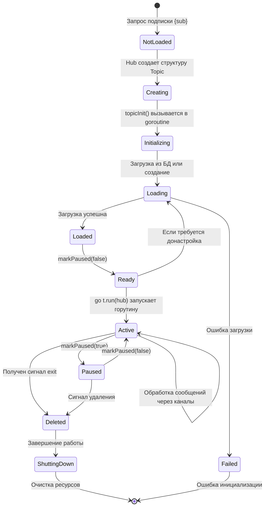
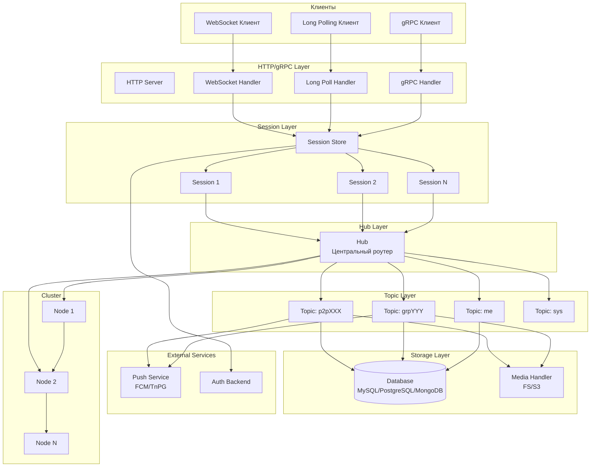
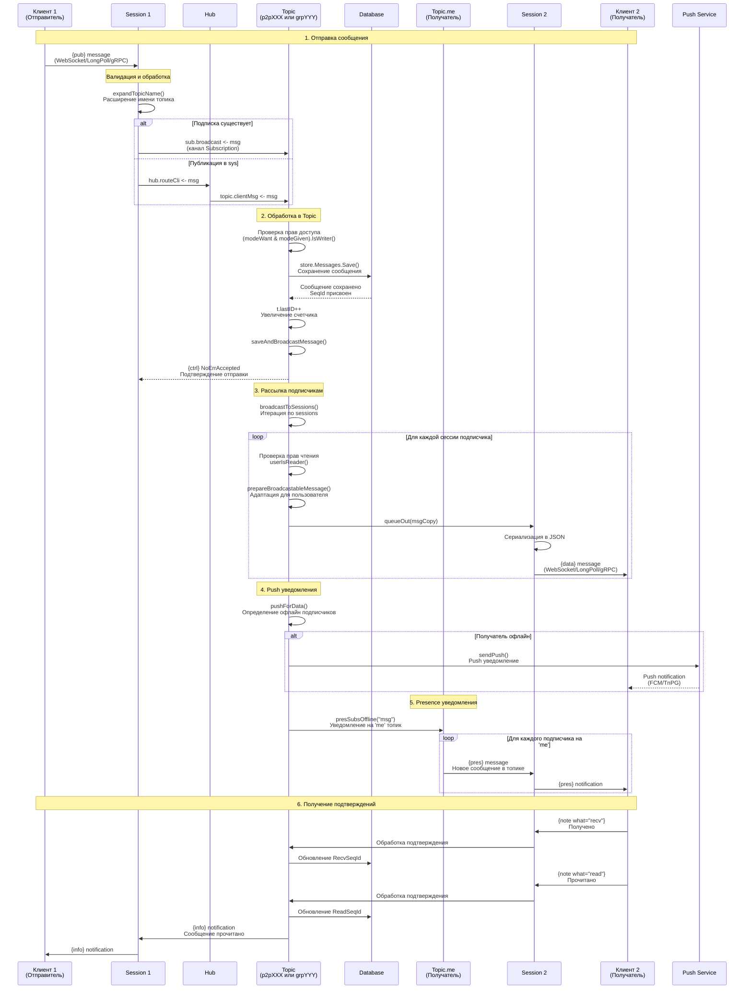
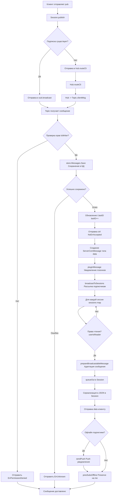
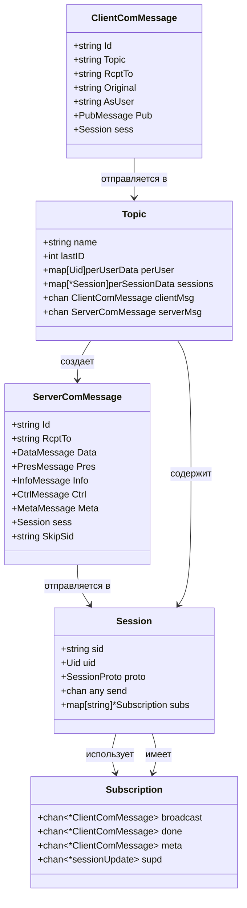
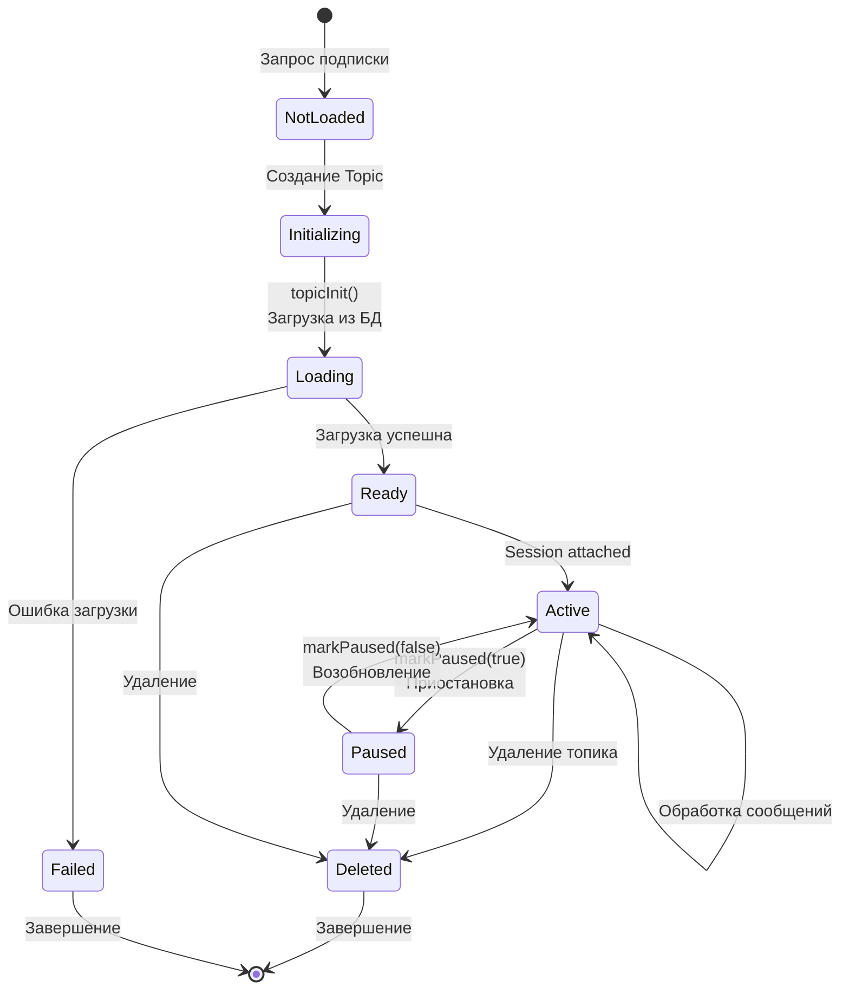
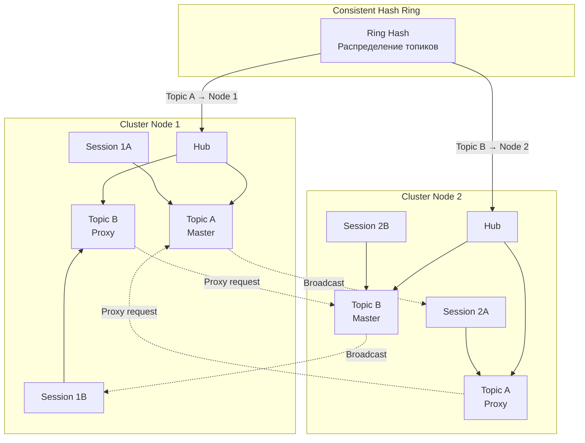

# Анализ архитектуры Tinode Chat

## Обзор проекта

Tinode Chat - это сервер мгновенных сообщений с архитектурой publish-subscribe, написанный на Go. Система поддерживает одноранговые (P2P) чаты, групповые чаты, каналы с подписчиками, а также поиск пользователей и топиков.

## Основные компоненты системы

### 1. Hub (Центральный роутер)
**Файл:** `server/hub.go`

Hub - это центральный компонент, который управляет всеми топиками и маршрутизирует сообщения между сессиями и топиками.

**Основные функции:**
- Управление жизненным циклом топиков
- Маршрутизация сообщений между топиками
- Обработка подписок/отписок
- Координация кластерной работы

**Ключевые каналы:**
- `routeCli` - маршрутизация клиентских сообщений (буфер: 4096)
- `routeSrv` - маршрутизация серверных сообщений (буфер: 4096)
- `join` - запросы на подписку к топикам (буфер: 256)
- `unreg` - удаление топиков (буфер: 256)

### 2. Topic (Каналы коммуникации)
**Файл:** `server/topic.go`

Topic представляет **изолированный канал коммуникации** между пользователями. Это основная единица маршрутизации сообщений в Tinode. Каждый топик работает в отдельной горутине и обрабатывает все запросы асинхронно через каналы (channels).

#### Что такое топик?

Топик - это абстракция чата или канала коммуникации. В терминах Tinode:
- **Один топик = один чат/беседа**
- Топики полностью изолированы друг от друга (нет прямого общения между топиками)
- Каждый топик управляет своими подписчиками и сообщениями
- Топик хранит состояние всех подписчиков и их права доступа

#### Структура данных топика

```go
type Topic struct {
    // Имя топика (уникальный идентификатор)
    name string      // Например: "p2pABC123XYZ", "grpDEF456", "usr789"
    xoriginal string // Оригинальное имя для клиента (например "me")
    
    // Категория топика
    cat types.TopicCat // Me, Fnd, P2P, Grp, Sys, Slf
    
    // Временные метки
    created time.Time // Когда создан
    updated time.Time // Когда обновлен
    touched time.Time // Когда последний раз отправлено сообщение
    
    // Состояние сообщений
    lastID int  // ID последнего сообщения (последовательный номер)
    delID  int  // ID последней операции удаления
    
    // Владелец топика (только для групповых)
    owner types.Uid
    
    // Права доступа по умолчанию
    accessAuth types.AccessMode // Для аутентифицированных
    accessAnon types.AccessMode // Для анонимных
    
    // Данные топика
    public  any  // Публичные данные (видны всем)
    trusted any  // Доверенные данные (видны только серверу)
    tags    []string // Теги для поиска
    
    // Данные подписчиков (ключ - UID пользователя)
    perUser map[types.Uid]perUserData
    
    // Прикрепленные сессии (ключ - указатель на Session)
    sessions map[*Session]perSessionData
    
    // Контакты пользователя (только для 'me' топика)
    perSubs map[string]perSubsData
    
    // Каналы для коммуникации
    clientMsg chan *ClientComMessage  // Сообщения от клиентов
    serverMsg chan *ServerComMessage  // Сообщения от сервера
    reg       chan *ClientComMessage  // Запросы на подписку
    unreg     chan *ClientComMessage  // Запросы на отписку
    meta      chan *ClientComMessage  // Метаданные (get/set/del)
    supd      chan *sessionUpdate     // Обновления сессий
    exit      chan *shutDown          // Завершение работы
    
    // Кластерная поддержка
    isProxy    bool      // Если true - это прокси-топик на удаленном узле
    masterNode string    // Имя узла-мастера (для прокси)
    proxy      chan *ClusterResp      // Ответы от мастера
    master     chan *ClusterSessUpdate // Запросы от прокси
    
    // Флаги состояния
    status int32 // new, ready, paused, deleted
    isChan bool  // Канал (read-only группа)
}
```

#### Типы топиков

**1. `me` (Personal Topic)**
- Личный топик каждого пользователя
- Используется для управления профилем и получения уведомлений
- Имя: `usr<user_id>` (например `usr2il9suCbuko`)
- Клиент видит его как `"me"`
- Особенности:
  - Автоматически создается для каждого пользователя
  - Хранит список контактов (`perSubs`)
  - Получает presence-уведомления о других топиках
  - Отслеживает User Agent устройств

**2. `fnd` (Find Topic)**
- Топик для поиска пользователей и топиков
- Имя: `usr<user_id>` (тот же что у `me`)
- Клиент видит его как `"fnd"`
- Особенности:
  - Используется для поиска по тегам
  - Не поддерживает публикацию сообщений

**3. `p2p` (Peer-to-Peer Topic)**
- Чат между двумя пользователями
- Имя: `p2p<uid1><uid2>` (отсортированные UID)
- Пример: `p2pABC123XYZ789`
- Особенности:
  - Автоматически создается при первом сообщении
  - Каждый участник видит имя топика как UID другого участника
  - Поддерживает видео-звонки (`currentCall`)
  - В P2P каждый участник имеет свой `public` и `trusted` (обмен данными)

**4. `grp` (Group Topic)**
- Групповой чат с множеством участников
- Имя: `grp<random_11_chars>` (например `grpYiqEXb4QY6s`)
- Особенности:
  - Создается явно пользователем
  - Имеет владельца (`owner`)
  - Максимум 256 подписчиков (по умолчанию)
  - Поддерживает каналы (`isChan = true`) - read-only группы

**5. `sys` (System Topic)**
- Системный топик для служебных сообщений
- Имя: `"sys"`
- Особенности:
  - Один на весь сервер
  - Все могут писать без подписки
  - Используется для системных уведомлений

**6. `slf` (Self Topic)**
- Топик для заметок себе и сохраненных сообщений
- Имя: `usr<user_id>`
- Клиент видит его как `"slf"`

#### Жизненный цикл топика



#### Создание и инициализация топика

**Процесс создания:**

1. **Клиент отправляет `{sub}`** запрос на подписку к топику
2. **Session** получает запрос и отправляет в Hub через канал `hub.join`
3. **Hub** проверяет, загружен ли топик:
   - Если нет - создает структуру `Topic` с каналами
   - Устанавливает статус `paused` (приостановлен)
   - Сохраняет топик в кеш: `hub.topics.Store(name, t)`
   - Запускает `topicInit()` в отдельной горутине

4. **topicInit()** определяет тип топика и вызывает соответствующую функцию:
   ```go
   switch {
   case t.xoriginal == "me":
       initTopicMe(t, join)
   case strings.HasPrefix(t.xoriginal, "p2p"):
       initTopicP2P(t, join)
   case strings.HasPrefix(t.xoriginal, "new"):
       initTopicNewGrp(t, join, false)
   // ... и т.д.
   }
   ```

5. **Инициализация** загружает данные из БД:
   - Подписчиков (`loadSubscribers()`)
   - Метаданные топика
   - Права доступа каждого подписчика
   - Состояние сообщений (`lastID`, `delID`)

6. **После успешной инициализации:**
   - `markPaused(false)` - топик активируется
   - `go t.run(hub)` - запускается главный цикл обработки

#### Главный цикл обработки топика

Каждый топик работает в своей горутине и обрабатывает события через select:

```go
func (t *Topic) runLocal(hub *Hub) {
    for {
        select {
        case msg := <-t.clientMsg:
            // Сообщение от клиента (pub, note, etc)
            t.handleClientMessage(msg)
            
        case msg := <-t.serverMsg:
            // Сообщение от сервера (из кластера)
            t.handleServerMessage(msg)
            
        case join := <-t.reg:
            // Запрос на подписку
            t.handleSubscription(join)
            
        case leave := <-t.unreg:
            // Запрос на отписку
            t.handleUnsubscription(leave)
            
        case meta := <-t.meta:
            // Запрос метаданных (get/set/del)
            t.handleMetaRequest(meta)
            
        case update := <-t.supd:
            // Обновление сессии (UA, background -> foreground)
            t.handleSessionUpdate(update)
            
        case shutdown := <-t.exit:
            // Завершение работы
            t.cleanup()
            return
        }
    }
}
```

#### Как топик обрабатывает сообщение

**Шаг 1: Получение сообщения**
```
Клиент → Session.publish() → sub.broadcast (канал) → Topic.clientMsg
```

**Шаг 2: Проверка прав доступа**
```go
pud := t.perUser[asUid]
if !(pud.modeWant & pud.modeGiven).IsWriter() {
    return ErrPermissionDenied
}
```

**Шаг 3: Сохранение в БД**
```go
store.Messages.Save(&types.Message{
    SeqId: t.lastID + 1,
    Topic: t.name,
    From:  asUid.String(),
    Content: content,
})
t.lastID++
```

**Шаг 4: Рассылка подписчикам**
```go
t.broadcastToSessions(&ServerComMessage{
    Data: &MsgServerData{
        Topic: msg.Original,
        From:  msg.AsUser,
        SeqId: t.lastID,
        Content: content,
    },
})
```

**Шаг 5: Отправка каждому подписчику**
```go
for sess, pssd := range t.sessions {
    if t.userIsReader(pssd.uid) {
        sess.queueOut(msgCopy) // Отправка в сессию
    }
}
```

#### Права доступа (Access Control)

Каждый подписчик имеет два набора прав:
- **`modeWant`** - желаемые права
- **`modeGiven`** - предоставленные права

**Эффективные права = `modeWant & modeGiven`**

**Базовые права:**
- **Read (R)** - чтение сообщений
- **Write (W)** - отправка сообщений
- **Join (J)** - возможность подписки
- **Owner (O)** - владелец топика
- **Delete (D)** - удаление сообщений
- **Approve (A)** - одобрение запросов на подписку

**Пример:**
```go
// Пользователь хочет читать и писать
modeWant = "JRWS"

// Ему предоставлено только чтение
modeGiven = "JR"

// Эффективные права = "JR" (только чтение)
effective = modeWant & modeGiven = "JR"
```

#### Уничтожение топика

Топик уничтожается когда:
1. Нет активных сессий + таймер истек (`killTimer`)
2. Получен сигнал удаления (`exit` с reason `StopDeleted`)
3. Система завершает работу (`StopShutdown`)
4. Кластер ребалансировка (`StopRehashing`)

**Процесс уничтожения:**
1. `markDeleted()` - устанавливает флаг
2. Отключение всех сессий
3. Очистка каналов
4. Удаление из кеша Hub
5. Горутина завершается

### 3. Session (Сессии клиентов)
**Файл:** `server/session.go`

Session представляет соединение между клиентом и сервером.

**Типы протоколов:**
- `WEBSOCK` - WebSocket соединение
- `LPOLL` - Long Polling
- `GRPC` - gRPC соединение
- `PROXY` - прокси-сессия в кластерном режиме
- `MULTIPLEX` - мультиплексирующая сессия для кластера

**Основные функции:**
- Прием и отправка сообщений клиенту
- Управление подписками на топики
- Обработка аутентификации
- Сериализация/десериализация сообщений

**Ключевые каналы:**
- `send` - исходящие сообщения к клиенту (буферизованный)
- `stop` - канал для остановки сессии
- `detach` - отключение от топиков

### 4. Store (Хранилище данных)
**Файл:** `server/store/store.go`

Абстракция для работы с базами данных. Поддерживает несколько бэкендов:
- MySQL/MariaDB
- PostgreSQL
- MongoDB
- RethinkDB (deprecated)

**Основные функции:**
- Сохранение и загрузка сообщений
- Управление пользователями и топиками
- Управление подписками
- Управление файлами и вложениями

### 5. Cluster (Кластерная поддержка)
**Файл:** `server/cluster.go`

Обеспечивает горизонтальное масштабирование через распределение топиков между узлами кластера.

**Основные функции:**
- Распределение топиков по узлам (consistent hashing)
- Маршрутизация сообщений между узлами
- Репликация данных между узлами
- Обработка отказов узлов

### 6. Push Notifications
**Файл:** `server/push.go`

Система push-уведомлений для офлайн пользователей. Поддерживает:
- FCM (Firebase Cloud Messaging)
- TnPG (Tinode Push Gateway)
- Stdout (для отладки)

## Архитектурная диаграмма системы



## Детальный поток сообщения от одного участника другому



## Детальная архитектура обработки сообщения в Topic



## Структура данных сообщения



## Жизненный цикл топика



## Кластерная архитектура (распределение топиков)



## Особенности реализации

### 1. Каналы и горутины
- Все компоненты общаются через каналы (channels)
- Каждый Topic работает в отдельной горутине
- Каждая Session имеет горутины для чтения и записи
- Hub работает в главной горутине, координируя работу всех топиков

### 2. Буферизация
- Каналы буферизованы для предотвращения блокировок
- При переполнении буфера отправляется ошибка 503 (Service Unavailable)
- Логирование предупреждений при переполнении

### 3. Права доступа (Access Control)
- Каждый подписчик имеет `modeWant` (желаемые права) и `modeGiven` (предоставленные права)
- Эффективные права = `modeWant & modeGiven`
- Права включают: Read (R), Write (W), Join (J), Owner (O), Delete (D), Approve (A)

### 4. Сохранение сообщений
- Сообщения сохраняются синхронно перед рассылкой
- Каждому сообщению присваивается уникальный `SeqId`
- Поддерживаются вложения (attachments)
- Отправитель может пометить сообщение как прочитанное сразу

### 5. Push уведомления
- Отправляются только для офлайн подписчиков
- Определяются через проверку активных сессий
- Поддерживается несколько провайдеров (FCM, TnPG, Stdout)

### 6. Presence уведомления
- Отправляются на топик `me` для всех пользователей
- Уведомляют о новых сообщениях в подписанных топиках
- Фильтруются по правам доступа

## Производительность и масштабируемость

1. **Горизонтальное масштабирование**: Поддержка кластеризации через consistent hashing
2. **Асинхронная обработка**: Использование каналов и горутин для параллельной обработки
3. **Буферизация**: Буферизованные каналы для сглаживания пиковых нагрузок
4. **Кэширование**: Топики кэшируются в памяти Hub
5. **Пакетная обработка**: Поддержка батчинга сообщений в некоторых протоколах

## Заключение

Tinode Chat использует архитектуру publish-subscribe с центральным Hub для маршрутизации сообщений. Каждый топик обрабатывается независимо в своей горутине, что обеспечивает высокую производительность и масштабируемость. Сообщения сохраняются синхронно в базу данных, а затем асинхронно рассылаются всем подписчикам через их сессии.

