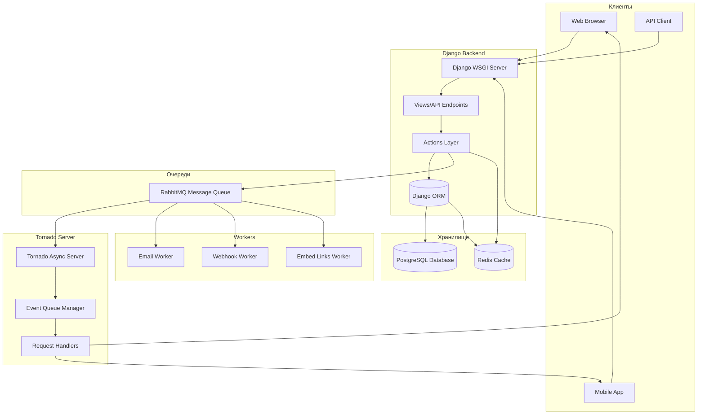
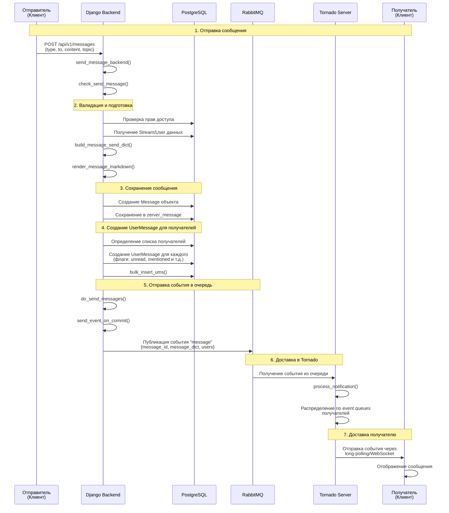
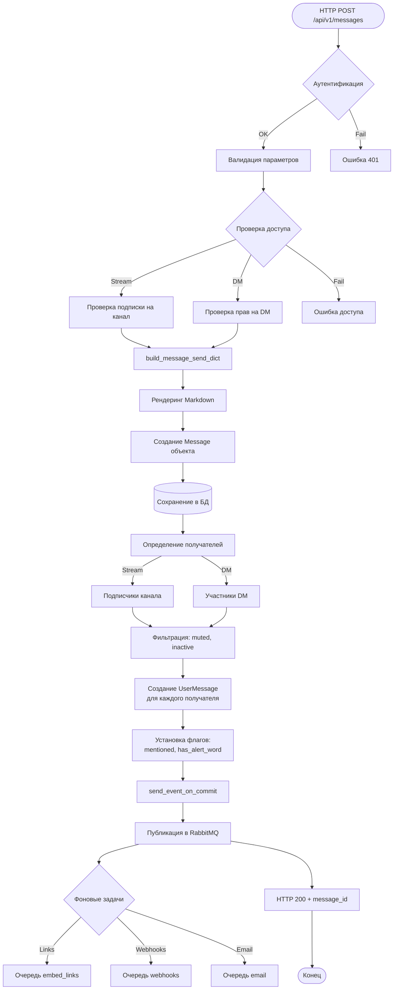
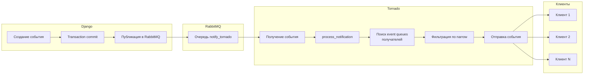
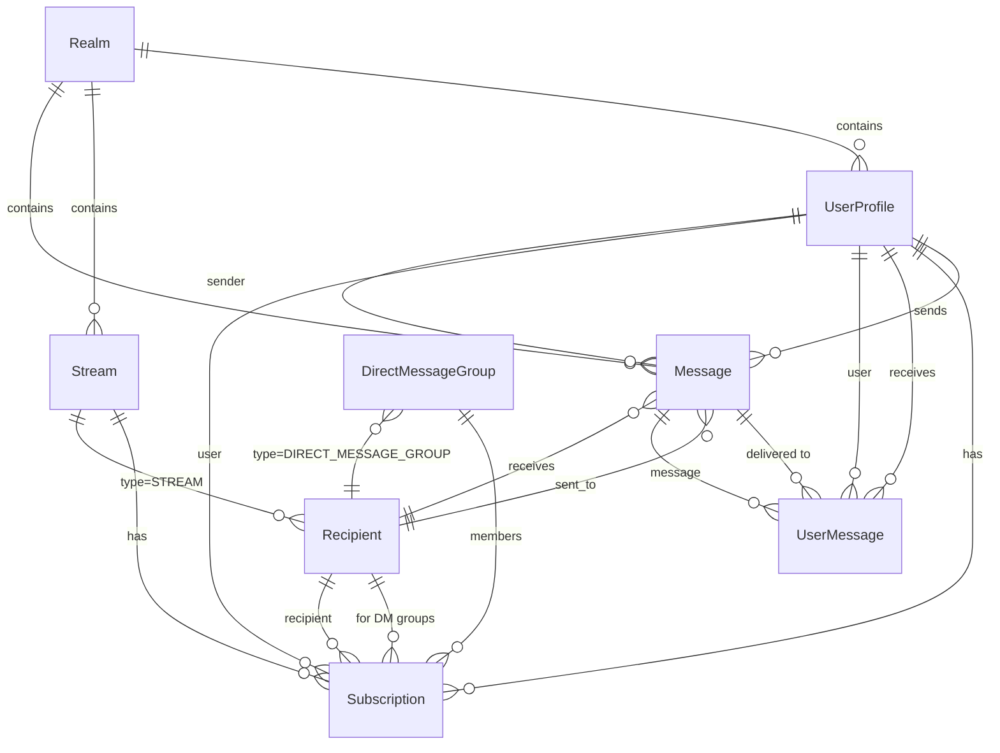
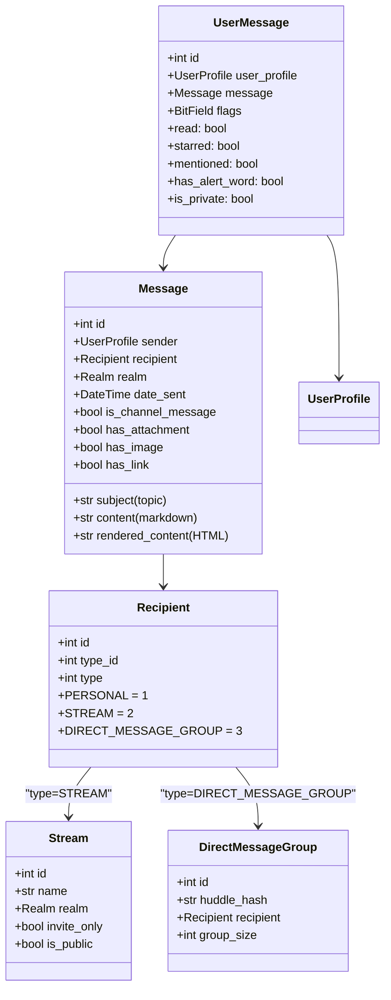
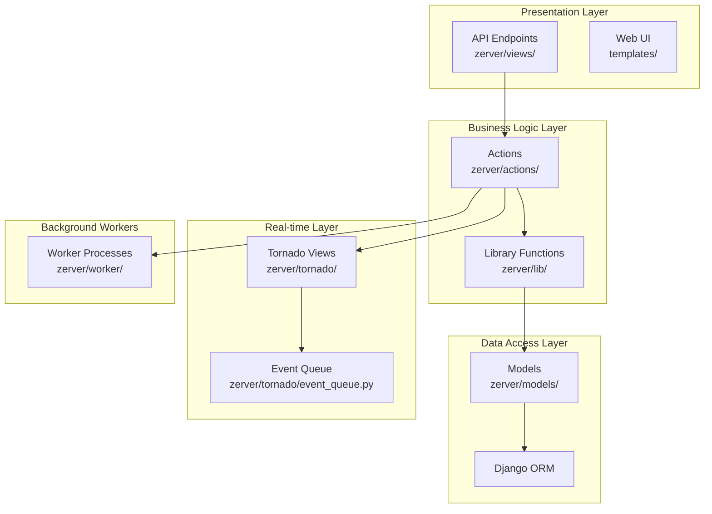

# Анализ архитектуры Zulip

## Обзор проекта

Zulip - это система командного обмена сообщениями с уникальной организацией по топикам (topic-based threading), которая сочетает в себе лучшие черты email и чата. Проект построен на Django (Python) с использованием Tornado для real-time доставки сообщений.

## Ключевые понятия

### Основные сущности

**Realm (Организация)**
- Изолированная организация пользователей в Zulip
- Каждый realm имеет свой поддомен и настройки
- Пользователи принадлежат одному realm

**UserProfile (Профиль пользователя)**
- Представляет пользователя в системе
- Может быть обычным пользователем или ботом
- Содержит настройки уведомлений, предпочтения и т.д.

**Stream (Канал/Поток)**
- Публичный или приватный канал для групповых обсуждений
- Пользователи подписываются на streams
- Может быть публичным (доступен всем) или приватным (invite-only)

**Recipient (Получатель)**
- Универсальная модель для определения адресата сообщения
- Типы: PERSONAL (1:1 DM), STREAM (канал), DIRECT_MESSAGE_GROUP (групповой DM)
- Использует type_id для ссылки на конкретный объект (UserProfile, Stream, DirectMessageGroup)

**Message (Сообщение)**
- Основная модель сообщения
- Содержит: отправителя, получателя (Recipient), тему, контент (markdown), отрендеренный HTML
- Хранится в PostgreSQL

**UserMessage (Связь пользователя с сообщением)**
- Связывает пользователя с сообщением
- Хранит флаги: read, starred, mentioned, has_alert_word и т.д.
- Создается для каждого получателя сообщения
- Критична для производительности - позволяет быстро находить непрочитанные сообщения пользователя

**DirectMessageGroup (Групповой прямой диалог)**
- Группа пользователей для групповых DM
- Членство хранится через Subscription к Recipient типа DIRECT_MESSAGE_GROUP

**Subscription (Подписка)**
- Связывает пользователя с Recipient (Stream или DirectMessageGroup)
- Определяет, кто получает сообщения в канале или группе

**Event Queue (Очередь событий)**
- Система для real-time доставки событий клиентам
- Каждый клиент имеет свою очередь событий
- Управляется Tornado сервером

**Client (Клиент)**
- Тип клиента, отправившего сообщение (web, mobile, API и т.д.)

### Архитектурные компоненты

**Django Backend**
- Обрабатывает HTTP запросы
- Выполняет бизнес-логику
- Работает с базой данных PostgreSQL
- Отправляет события в Tornado через RabbitMQ

**Tornado Server**
- Асинхронный сервер для real-time доставки
- Управляет event queues для клиентов
- Получает события от Django через RabbitMQ
- Отправляет события клиентам через long-polling или WebSocket

**RabbitMQ**
- Очередь сообщений между Django и Tornado
- Обеспечивает надежную доставку событий
- Поддерживает шардинг по портам для масштабирования

**PostgreSQL**
- Основная база данных
- Хранит все данные: сообщения, пользователей, настройки и т.д.

## Общая архитектура системы

## Поток сообщения от отправителя к получателю

### Детальная схема прохождения сообщения

### Схема обработки сообщения в Django

### Схема доставки события получателю

## Структура данных

### Схема основных моделей

### Детальная структура Message и UserMessage

## Компоненты системы

### Слои приложения

### Ключевые модули

**zerver/views/message_send.py**
- `send_message_backend()` - основной endpoint для отправки сообщений
- Обрабатывает HTTP запросы POST /api/v1/messages
- Валидирует параметры и вызывает actions

**zerver/actions/message_send.py**
- `check_send_message()` - основная функция отправки
- `build_message_send_dict()` - подготовка данных сообщения
- `do_send_messages()` - сохранение и доставка
- `create_user_messages()` - создание UserMessage записей
- `send_event_on_commit()` - отправка события в очередь

**zerver/tornado/event_queue.py**
- `EventQueue` - управление очередями событий
- `ClientDescriptor` - дескриптор клиентского соединения
- `process_notification()` - обработка уведомлений от Django

**zerver/tornado/django_api.py**
- `send_event_on_commit()` - отправка события после commit транзакции
- `send_event_rollback_unsafe()` - отправка события напрямую
- Коммуникация с Tornado через HTTP или напрямую

**zerver/models/messages.py**
- `Message` - модель сообщения
- `UserMessage` - связь пользователя с сообщением
- `AbstractMessage` - базовая модель

**zerver/models/recipients.py**
- `Recipient` - модель получателя
- `DirectMessageGroup` - модель группового DM

## Особенности реализации

### 1. Система доставки сообщений

**UserMessage для каждого получателя**
- Для каждого сообщения создается отдельная запись UserMessage для каждого получателя
- Это позволяет эффективно отслеживать статус прочтения для каждого пользователя
- Флаги хранятся в битовом поле для экономии места

**Event Queue система**
- Каждый клиент имеет свою очередь событий
- События фильтруются по narrow (фильтрам просмотра)
- Long-polling для получения событий в реальном времени

### 2. Обработка получателей

**Для Stream сообщений:**
1. Получение всех подписчиков канала (Subscription)
2. Фильтрация по правам доступа
3. Исключение muted пользователей
4. Учет настроек уведомлений

**Для Direct Messages:**
1. Определение участников DM (для групповых - через DirectMessageGroup)
2. Проверка прав доступа к пользователям
3. Создание UserMessage для каждого участника

### 3. Рендеринг и обработка контента

**Markdown рендеринг:**
- Контент хранится в markdown формате
- HTML версия генерируется при сохранении
- Поддержка упоминаний (@user, @group), ссылок, эмодзи

**Обработка упоминаний:**
- Парсинг упоминаний при рендеринге
- Установка флага `mentioned` в UserMessage
- Триггеры уведомлений для упомянутых пользователей

### 4. Фоновые задачи

**Embed Links Worker:**
- Обработка ссылок в сообщениях
- Получение Open Graph данных
- Генерация превью ссылок

**Email Worker:**
- Отправка email уведомлений
- Digest emails
- Missed message emails

**Webhook Worker:**
- Обработка outgoing webhooks
- Интеграции с внешними системами

## Производительность и масштабирование

### Индексы базы данных

**Message:**
- `realm_id, recipient_id, id` - для быстрого поиска по каналу
- `realm_id, sender_id, recipient_id` - для поиска сообщений пользователя
- `search_tsvector` - полнотекстовый поиск

**UserMessage:**
- Частичные индексы для разных флагов (starred, mentioned, unread)
- `user_profile, message` - уникальный индекс
- `user_profile, message` с условием на флаги

### Шардинг Tornado

- Поддержка нескольких процессов Tornado
- Распределение пользователей по портам
- RabbitMQ очереди для каждого порта

### Кэширование

- Redis для кэширования
- Кэш профилей пользователей
- Кэш настроек realm

## Безопасность

1. **Проверка доступа:**
   - Валидация прав на отправку в канал
   - Проверка подписки на канал
   - Проверка прав на отправку DM

2. **Фильтрация контента:**
   - Санитизация HTML при рендеринге
   - Защита от XSS
   - Валидация входных данных

3. **Изоляция данных:**
   - Realm-based изоляция
   - Проверка прав на доступ к сообщениям
   - Фильтрация по narrow для клиентов

## Заключение

Архитектура Zulip построена на разделении ответственности:
- **Django** обрабатывает бизнес-логику и работу с БД
- **Tornado** обеспечивает real-time доставку
- **RabbitMQ** связывает компоненты
- **PostgreSQL** хранит данные

Ключевая особенность - система UserMessage, которая позволяет эффективно отслеживать статус сообщений для каждого пользователя, и event queue система для real-time доставки.

